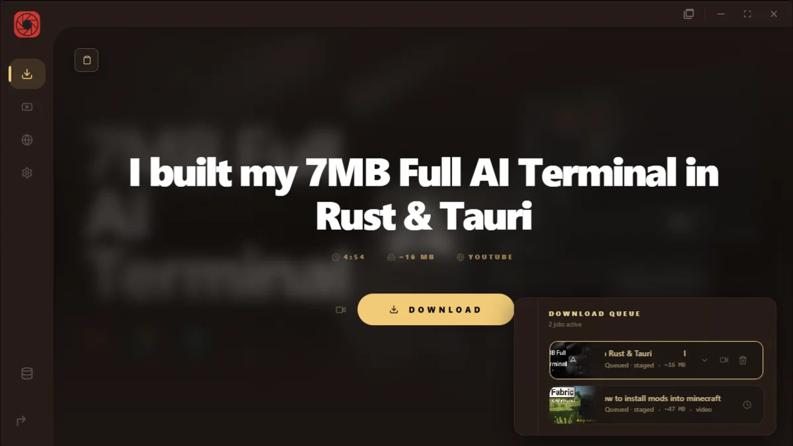
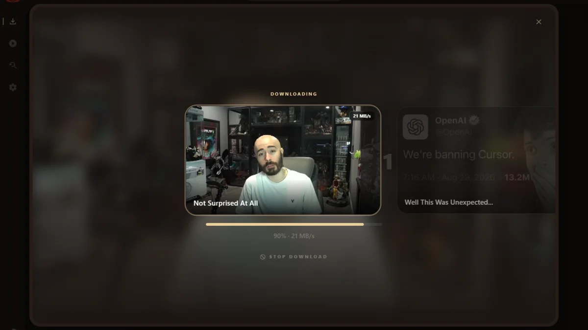
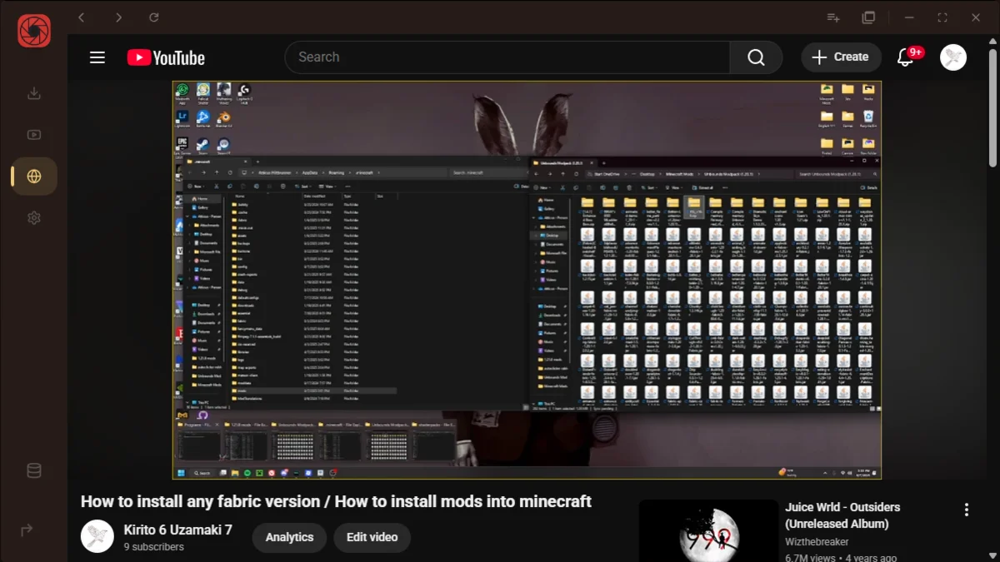
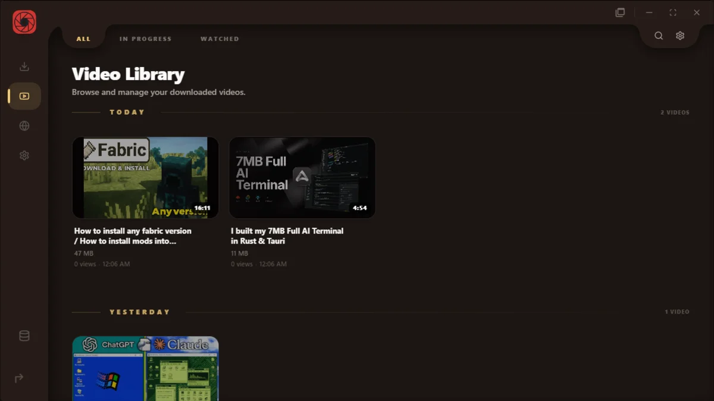
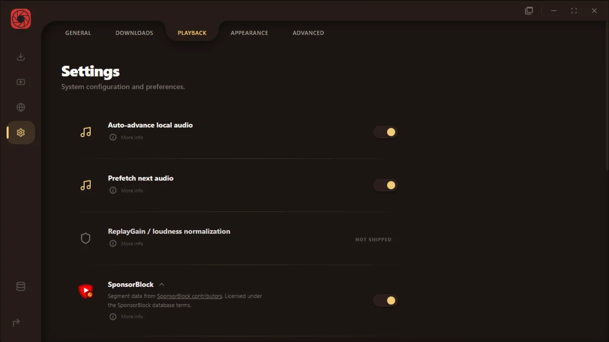

# RuForge

Desktop app for downloading YouTube video and audio with yt-dlp, storing a local library, and playing it back. Aimed at people who want YouTube plus a music shell on disk, not a general media server.

**0.3.0**, pre-1.0. Shipped installs and the auto-updater are Windows (NSIS). Linux is local `tauri dev` only.

## Screenshots











## Features

### Downloads

- YouTube and YouTube Music URLs through bundled yt-dlp, ffmpeg, and ffprobe. Drop intake accepts YouTube watch and playlist URLs only.
- Centered hero plus queue; up to 6 parallel jobs (default 1); playlist batches retry failed tracks up to 3 attempts.
- Audio-only (`m4a` / `mp3` / `opus`), quality presets, optional subtitle sidecars and `{stem}.comments.json`.
- Cookies: none, Internal Explorer session, Firefox / Edge / Safari / Brave, or a cookies.txt file.
- Duplicate handling (prompt, or skip automatically). Queue survives the session (`ruforge-download-queue`).
- Embedded Explorer (YouTube) for cookies/session and queue-from-browse. Music Explore embeds `music.youtube.com`.

### Library and player

- Vault buckets: `Videos/`, `Music/`, `Movies/`, `Shows/`, `Playlists/`, `Unsorted/`. Extra scan folders are optional.
- Player: keyboard shortcuts, playback speed, chapters, drag-position subtitle overlay, SponsorBlock (on by default), scrub hover previews, comments panel, resume.
- Activity island while you leave the player tab. Separate video mini player window.
- Windows taskbar thumbnail buttons: like, previous, play/pause, next.
- Crash recovery screen after a renderer failure.

### Music mode

- Own shell: Home, Explore, Library; now-playing bar; artist / album / track pages; liked songs; listen stats.
- Track pages show MusicBrainz-backed credits. Playlist batches write `Playlists/{folder}/.ruforge-playlist.json`.
- Separate music mini player. Switch modes from the sidebar or hold Alt for the radial menu.

### Housekeeping

- Storage limit (default 50GB) blocks new Internal Vault downloads when usage meets the cap. Authorize Cleanup and Recently Deleted restore.
- Export bundle copies selected media off disk. In-app app updates. yt-dlp self-update and optional Deno install from Settings (Deno lands in app data, not PATH).
- Optional Discord Rich Presence (off by default). Launch at startup and minimize to tray.

## Tech stack

Declared in `package.json` / `src-tauri/Cargo.toml` / `src-tauri/tauri.conf.json`:

- Tauri `2` (`Cargo.lock`: 2.11.1), Rust 2021 edition, identifier `com.attic.ruforge`
- React `^19.1.0`, TypeScript `~5.8.3`, Vite `^6.3.5`, Tailwind CSS `^4.0.0`, Zustand `^5.0.13`
- Bundled sidecars: `binaries/yt-dlp`, `binaries/ffmpeg`, `binaries/ffprobe`
- Updater endpoint: `https://raw.githubusercontent.com/UnboundAngel/RuForge/main/updater.json`
- Deep link scheme: `ruforge`

## Getting started

Prerequisites: Node.js TODO(verify). Rust TODO(verify) (crate edition 2021). Windows builds need WebView2. `npm run dev:app` is a PowerShell script.

```bash
git clone https://github.com/UnboundAngel/RuForge.git
cd RuForge
npm install
```

Windows dev (Tauri plus Companion asset watcher):

```powershell
npm run dev:app
```

Tauri only (Windows or Linux):

```bash
npm run tauri -- dev
```

Frontend alone (Vite, no Rust shell):

```bash
npm run dev
```

Production web assets, then the desktop bundle (`beforeBuildCommand` already runs `npm run build`):

```bash
npm run tauri -- build
```

NSIS installer under `src-tauri/target/release/bundle/nsis/`. Binary `src-tauri/target/release/ruforge.exe`. Tests: `npm test`.

Windows installers: [Releases](https://github.com/UnboundAngel/RuForge/releases).

## Configuration

No root `.env.example`. Dev server: `http://localhost:1420` (`strictPort`). If `TAURI_DEV_HOST` is set, HMR uses port `1421`. Compile-time telemetry keys for signed builds: `src-tauri/TELEMETRY.example.env` (`APTABASE_APP_KEY`, `APTABASE_HOST`, `GLITCHTIP_DSN`). Usage and crash telemetry are off by default and sit on the Debugging settings tab.

User data:

- Settings: WebView `localStorage` key `ruforge-settings`
- Library paths: tauri-plugin-store file `library-config.json`
- Default vault: `C:\RuForge\Media` (Windows) or `$HOME/RuForge/Media`. Default output: `C:\Downloads` (Windows) or the OS downloads dir
- Tauri `app_data_dir` for `com.attic.ruforge`: `bin/` (yt-dlp, Deno), `explorer-data/` (Explorer profile), `recently-deleted.json`
- Tauri `app_local_data_dir`: `hardware-acceleration.json`

## Project structure

- `src/` - React/TypeScript UI (main, mini, music-mini, island, notify windows)
- `src-tauri/` - Rust backend, sidecars, NSIS bundle, companion-web (debug-gated)
- `scripts/` - Windows dev/build helpers (`dev-app.ps1`, signed build)
- `website/` - Public site (separate `package.json`)
- `docs/` - Agent and research docs
- `public/` - Static assets copied into the web build
- `imports/` - Upstream reference checkouts, not the app

## Contributing

Public repo: [UnboundAngel/RuForge](https://github.com/UnboundAngel/RuForge). App code is `src/` and `src-tauri/`.

## License

Apache License 2.0. See [LICENSE](./LICENSE).
