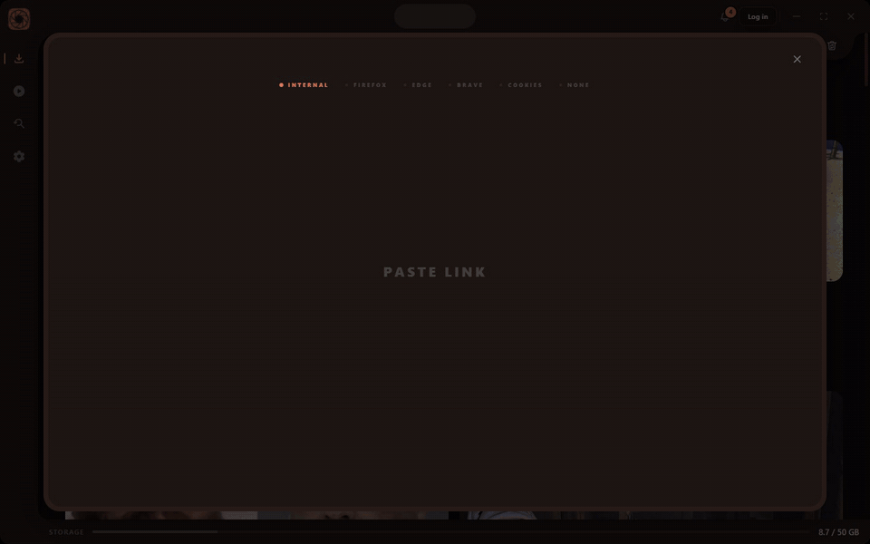

# RuForge

RuForge is a free, open-source Windows app that saves YouTube videos and music to your PC, keeps them in one library, and plays them offline.

<!-- HERO GIF: 10-15s loop. Paste a link, download it, open it in Music mode with synced lyrics scrolling. ~1200px wide, under 8 MB. Uncomment once docs/media/hero.gif exists.

-->

## What it adds on top of yt-dlp

- **Music mode.** A separate music player for your downloaded audio: artist, album and track pages, liked songs, playlists you build yourself, and listening stats.
- **Synced lyrics.** Lyrics from LRCLIB that highlight line by line as the song plays.
- **Smart shuffle.** Shuffle that favors songs you like and play often, holds back songs you just heard, and makes the same artist back to back less likely.
- **Music-only skip.** Jumps past the parts of a music video that SponsorBlock marks as non-music while it plays, so only the song plays. The downloaded file is not cut.
- **SponsorBlock at playback.** yt-dlp can cut SponsorBlock segments out of the file when it downloads. RuForge keeps the file whole and skips sponsor segments, intros and other categories you pick while you watch (on by default), so you can change your mind later.
- **A video player built for downloads.** Chapters, hover previews on the seek bar, subtitles, the video's comments, and resume where you left off.
- **One library.** Videos, music, playlists and channels in folders on your own drive, with a storage limit and a Recently Deleted bin.

## Install

- **Installer:** [ruforge.app/download](https://ruforge.app/download) or [GitHub Releases](https://github.com/UnboundAngel/RuForge/releases). Installs for your Windows account only, no admin rights needed.
- **WinGet:** submitted, waiting for review ([microsoft/winget-pkgs#446178](https://github.com/microsoft/winget-pkgs/pull/446178)). Once approved: `winget install UnboundAngel.RuForge`
- **From source:** see [Building from source](#building-from-source).

The installer is not code-signed yet, so Windows SmartScreen may show a warning the first time you run it.

RuForge updates itself from inside the app.

**Privacy:** There are no accounts, no ads, no usage stats and no crash reports. The update check is the only request the project counts. [Security and privacy](https://ruforge.app/docs/security-and-privacy) lists everything RuForge connects to and why.

---

## Features

### Downloads

- YouTube and YouTube Music videos, playlists and audio, through the bundled yt-dlp, FFmpeg and FFprobe.
- Audio-only downloads (`m4a`, `mp3`, `opus`), quality presets, optional subtitles and saved comments.
- Up to 6 downloads at once. Failed playlist tracks retry up to 3 times. The queue survives a restart.
- Sign-in options for yt-dlp: the built-in YouTube browser, cookies from Firefox, Edge or Brave, or a cookies.txt file.
- Follow channels and get new uploads in the notification bell.

### Library and player

- Library folders for Videos, Music, Movies, Shows, Playlists and Unsorted, plus any extra folders you add.
- Keyboard shortcuts, playback speed, chapters, movable subtitles, SponsorBlock, seek bar previews, comments, resume.
- A mini player window and Windows taskbar buttons for like, previous, play/pause and next.

### Music mode

- Home, Explore and Library; artist, album and track pages with MusicBrainz credits; liked songs; playlists; listening stats.
- Synced lyrics, smart shuffle, music-only skip.
- A separate music mini player. Switch modes from the sidebar.

### Housekeeping

- Storage limit (50 GB by default), cleanup, and Recently Deleted restore.
- Export copies of selected media to another drive.
- Optional Discord status (off by default). Launch at startup and minimize to tray.

## How yt-dlp stays up to date

YouTube changes often, and yt-dlp releases fixes to keep up. RuForge handles that for you:

1. Every installer ships with a recent yt-dlp.
2. When RuForge opens, it checks yt-dlp's [GitHub releases](https://github.com/yt-dlp/yt-dlp/releases) for a newer version.
3. If there is one, the download screen offers a one-click update. You can also update from Settings > Downloads.
4. RuForge only accepts files from `github.com/yt-dlp/yt-dlp/releases` and runs the new copy with `--version` before it replaces anything.
5. If the bundled copy and the downloaded copy differ, RuForge uses whichever is newer.

## Credits and licenses

RuForge is licensed under the [Apache License 2.0](./LICENSE). The installer also includes these programs, each under its own license:

- **[yt-dlp](https://github.com/yt-dlp/yt-dlp)**, The Unlicense.
- **[FFmpeg](https://ffmpeg.org/) and FFprobe** 8.1.1 ([gyan.dev](https://www.gyan.dev/ffmpeg/builds/) full build), GNU GPL version 3. RuForge runs them as separate programs and does not modify them. Source: [FFmpeg n8.1.1](https://github.com/FFmpeg/FFmpeg/tree/n8.1.1).
The full texts install with the app in the `licenses` folder ([source](src-tauri/licenses/)).

RuForge also reads data from these services while you use it:

- **[SponsorBlock](https://sponsor.ajay.app/)** segments, CC BY-NC-SA 4.0. Used for skipping in the video and music players.
- **[LRCLIB](https://lrclib.net/)** lyrics, for synced lyrics in Music mode. The LRCLIB server is MIT-licensed; the lyrics have no license from LRCLIB and belong to their rights holders. RuForge shows them and saves them next to the song for your own playback.
- **[MusicBrainz](https://musicbrainz.org/)**, for track credits and artist details. Core data is CC0; supplementary data such as tags is CC BY-NC-SA 3.0 ([data license](https://musicbrainz.org/doc/About/Data_License)). Album art comes from the [Cover Art Archive](https://coverartarchive.org/), where each image belongs to its owner.
- **[Wikipedia](https://en.wikipedia.org/)**, for the bio and photo on artist pages, found through [Wikidata](https://www.wikidata.org/) (CC0). Bio text is CC BY-SA 4.0 and links back to the article; photos keep their own Wikimedia Commons licenses.

## Your responsibility

You're responsible for what you download. Follow the terms of the sites you use and copyright law where you live. See the [Terms of Use](https://ruforge.app/legal/terms).

## Building from source

Windows needs WebView2. `npm run dev:app` is a PowerShell script.

```bash
git clone https://github.com/UnboundAngel/RuForge.git
cd RuForge
npm install
```

Windows dev:

```powershell
npm run dev:app
```

Tauri only (Windows, or Linux for development; Linux builds are not shipped):

```bash
npm run tauri -- dev
```

Desktop bundle (runs `npm run build` first):

```bash
npm run tauri -- build
```

The NSIS installer lands in `src-tauri/target/release/bundle/nsis/`. Tests: `npm test`.

Dev server: `http://localhost:1430` (HMR on `1431`). No build-time keys needed.

## Project structure

- `src/` - React/TypeScript UI (main, mini, music mini, island and notification windows)
- `src-tauri/` - Rust backend, bundled tools, NSIS installer config
- `scripts/` - Windows dev and build helpers
- `website/` - [ruforge.app](https://ruforge.app) (separate `package.json`)
- `docs/` - Project docs

## License

Apache License 2.0. See [LICENSE](./LICENSE).
