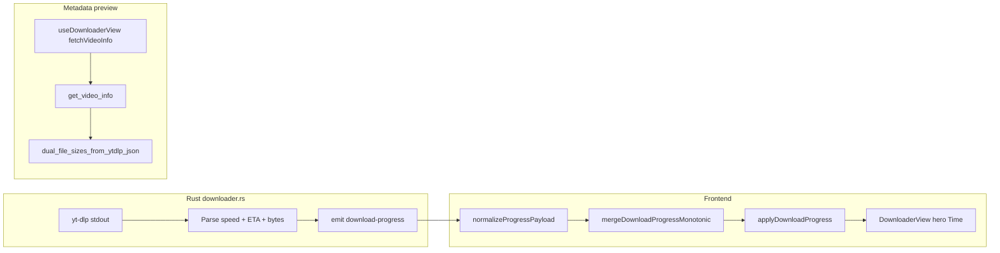

# Downloader: ETA smoothing and quality-accurate size

## Current data flow



Already shipped for progress stability (v0.1.7): [`mergeDownloadProgressMonotonic`](src/downloadProgress.ts) clamps **percentage** and **byte counters** only. **ETA and speed are untouched.**

---

## 1. ETA smoothing (backlog #9)

### Why it jumps

| Layer | Behavior |
|-------|----------|
| yt-dlp | Recomputes ETA from **instantaneous** speed every stdout line; fragment/HLS progress makes speed noisy. |
| [`downloader.rs`](src-tauri/src/commands/downloader.rs) ~1193-1237 | Parses `speed` and `eta` (token with `:` after index 4) and emits them raw on every `[download]` line. |
| [`downloadProgress.ts`](src/downloadProgress.ts) | Monotonic merge for `%` / bytes only. |
| [`DownloaderView.tsx`](src/components/DownloaderView.tsx) ~1035-1038 | Renders `d.progress.eta` directly (hero “Time”). Queue rows do **not** show ETA today. |

So the UI mirrors yt-dlp’s volatile estimate. That is expected industry-wide when you surface raw stderr without filtering.

### Recommended approach (frontend-first, matches STATE.md)

Implement smoothing in TypeScript at **`applyDownloadProgress`** (single choke point in [`downloadQueueSlice.ts`](src/store/downloadQueueSlice.ts)), not in Rust:

1. **Per-job sample buffer** (module-level `Map<jobId, …>`, cleared in `onDownloadJobFinished` / pause if needed):
   - Record `(timestampMs, downloadedBytes)` when `downloadedBytes` and `totalBytes` exist (already parsed in Rust via `parse_ytdlp_percent_of_total_bytes`).
   - Compute **bytes/sec** from delta over last **N** samples (e.g. 8-12) or EMA (alpha ~0.15-0.25).
2. **Derived ETA** (preferred when bytes known):
   - `remaining = totalBytes - downloadedBytes`
   - `etaSec = remaining / smoothedBps`
   - Clamp display: max **decrease** per tick (e.g. 3-5s) so countdown does not “teleport” shorter; allow increases more freely when speed drops.
   - Hide ETA until **2+ valid samples** (avoids wild first second).
3. **Fallback** when bytes missing: parse yt-dlp `eta` (`MM:SS` / `HH:MM:SS`) to seconds and apply **EMA on seconds** (simpler than trusting speed string parsing).
4. **Format** output like yt-dlp (`H:MM:SS` or `M:SS`) in a small helper next to [`mergeDownloadProgressMonotonic`](src/downloadProgress.ts).
5. Optionally smooth **`speed`** string for hero display using the same Bps (secondary polish).

**Do not** smooth percentage further; monotonic merge stays as-is.

### Files to touch (ETA)

- [`src/downloadProgress.ts`](src/downloadProgress.ts): add `smoothDownloadProgressEta(prev, next, jobId, nowMs)` (or split into `downloadEtaSmoothing.ts` if it grows).
- [`src/store/downloadQueueSlice.ts`](src/store/downloadQueueSlice.ts): call smoother inside `applyDownloadProgress`; reset state in `onDownloadJobFinished`.
- No UI changes unless you want queue ETA later.

### Manual test checklist

- Single video, 1080p: hero “Time” counts down steadily, no multi-minute swings.
- Audio-only (`-x`): ETA still behaves during extract/processing phases (processing may freeze ETA; acceptable).
- Pause/resume: buffer resets or soft-resets so resume does not inherit stale speed.
- Concurrent jobs: buffers keyed by `jobId`, no cross-talk.

---

## 2. Quality-accurate file size (F-12 / preview accuracy)

### Reported regression: audio-only 120 MB vs 528 MB (3-hour video)

Real session you hit:

| | Value |
|---|------|
| Mode | Audio-only |
| Duration | ~3 hours |
| UI preview | ~120 MB |
| File on disk after download | ~528 MB (~4.4x underestimate) |

Rough bitrate check (helps sanity-check whether 528 MB is plausible, not necessarily wrong):

- 120 MB / 3h ≈ **93 kbps** average (what the UI likely estimated)
- 528 MB / 3h ≈ **407 kbps** average (what actually downloaded; consistent with high-quality AAC/Opus via `bestaudio/best` + `--audio-quality 0`)

So the preview probably locked onto a **low-bitrate audio format** in the manifest, while the real job pulled **`bestaudio/best` at best VBR** (see [`build_ytdlp_download_args`](src-tauri/src/commands/downloader.rs): `-f bestaudio/best`, `-x`, `--audio-quality 0`).

**Why our code can show ~120 MB today**

1. **`get_video_info` does not simulate** (`yt_dlp_single_json_simulate(..., None, None)`), then [`pick_best_audio_size_from_formats`](src-tauri/src/commands/downloader.rs) scans the full `formats` list and picks a size from whichever pure-audio row wins the `abr`/`tbr` scoring. That row is not guaranteed to be the same stream yt-dlp selects for `bestaudio/best` on the actual download.
2. **Many audio rows lack `filesize`**; we fall back to `duration * tbr` ([`size_from_format_entry_for_dual`](src-tauri/src/commands/downloader.rs)). A modest `tbr` on the wrong row yields ~100–130 MB for a 3h file even when `bestaudio` would land on a much higher bitrate stream.
3. **`start_download_job` already probes correctly** with `yt_dlp_single_json_simulate(&app, &url, Some(&options), None)` where `options.audio_only` forces `bestaudio/best` in [`ytdlp_simulate_format_eff`](src-tauri/src/commands/downloader.rs). Preview and download probes are **asymmetric today**: download path is closer to truth; hero/queue metadata path is not.
4. **Display** uses `fileSizeBytesAudio` when audio-only ([`downloadJobDisplayFileSizeBytes`](src/downloadJobFileSizes.ts)); the wrong number is in metadata, not a video/audio mode mix-up.

**Plan addition for audio-only (on top of general simulate fix)**

- Run **`get_video_info` simulate with the same `-f` as download** (`bestaudio/best` when audio-only). Prefer **`requested_formats` / `requested_downloads` sizes** from that JSON (already supported in [`video_file_size_from_ytdlp_json`](src-tauri/src/commands/downloader.rs)).
- **Stronger alignment (recommended):** extend `get_video_info` to accept an `audioOnly` flag (or pass minimal `DownloadOptions`) so Rust uses the same `ytdlp_simulate_format_eff` branch as `start_download_job`, not only a format string from the frontend.
- **Sanity fallback if simulate omits sizes:** for audio-primary, upper-bound from format list: `duration * max(abr|tbr)` over pure-audio formats, and do not show an estimate below what `bestaudio/best` simulate returns. Avoid returning a single low-`tbr` row when `bestaudio` would clearly exceed it.
- **Manual regression:** 3h+ audio-only URL; preview within ~20% of finished file (your 528 MB case). Re-test after simulate fix.

528 MB for 3h is large but can be legitimate for “best” audio on YouTube; the bug is the **120 MB preview**, not necessarily that the final file is corrupt.

### Why preview size disagrees with settings (video quality)

Frontend **does** map settings to yt-dlp format via [`ytdlpFormatFromPreferredQuality`](src/downloadFormat.ts) and passes it to `get_video_info` from [`useDownloaderView.ts`](src/components/downloader/useDownloaderView.ts) and queue hydration in [`downloadQueueSlice.ts`](src/store/downloadQueueSlice.ts).

Rust **ignores** that selector for simulate:

```874:876:src-tauri/src/commands/downloader.rs
    let json = yt_dlp_single_json_simulate(&app, &url, None, None).await?;
    let (file_size_bytes_audio, file_size_bytes_video) =
        dual_file_sizes_from_ytdlp_json(&json, fmt);
```

- `start_download_job` **does** simulate with `Some(&options)` (correct for the real download).
- `get_video_info` only uses `fmt` to derive `max_height` and heuristically pick streams from the **full** `formats` array ([`pick_best_video_only_size_from_formats`](src-tauri/src/commands/downloader.rs)), which can diverge from what `-f` would actually request (especially “Best Available”, DASH, and missing `filesize` fields).

### Secondary TS issues (stale/wrong UI even after Rust fix)

| Issue | Location |
|-------|----------|
| In-flight dedupe by **URL only** | [`downloadVideoInfoFetch.ts`](src/downloadVideoInfoFetch.ts) `inflightByUrl` — race if quality changes mid-fetch |
| Metadata cache key is **URL only** | [`downloadQueueMetadataCache.ts`](src/downloadQueueMetadataCache.ts) — changing Preferred Quality can show old `~size` from `peekDownloadJobMetadataCache` before network |
| Hero cache skip checks `videoInfoPreferredQuality` in Zustand but **not** localStorage cache | [`useDownloaderView.ts`](src/components/downloader/useDownloaderView.ts) ~932-937 |
| Focused idle hero prefers **job metadata** without format/quality match | [`DownloaderView.tsx`](src/components/DownloaderView.tsx) ~325-340 — OK for enqueued intent, wrong if user changed settings after enqueue |

### Recommended approach (size)

**A. Rust (primary fix)** — in `get_video_info`:

```rust
let json = yt_dlp_single_json_simulate(&app, &url, None, fmt).await?;
```

- Pass `fmt` (the frontend format string) as the 4th arg so yt-dlp `-J -s -f <selector>` runs the same simulation as download (minus cookies for now; cookies are a separate F-12 note in [STATE.md](STATE.md)).
- For **audio-only**, `fmt` is already `bestaudio/best` from [`ytdlpFormatFromSettings`](src/downloadFormat.ts); simulate must use that (fixes the 120 vs 528 MB class of bugs). Optionally pass `audio_only` into the command so simulate matches [`ytdlp_simulate_format_eff`](src-tauri/src/commands/downloader.rs) exactly.
- Prefer sizes from simulated JSON: `requested_formats` / `format_id` path in existing [`video_file_size_from_ytdlp_json`](src-tauri/src/commands/downloader.rs) should become authoritative; keep `dual_file_sizes_from_ytdlp_json` heuristic as fallback when simulate omits sizes.
- Add audio-only **sanity fallback** (max abr/tbr × duration) only when simulate returns nothing, not as the primary path.

**B. TypeScript cache and dedupe**

- Key in-flight fetch: `normalizeUrl(url) + '\x1f' + format` in [`downloadVideoInfoFetch.ts`](src/downloadVideoInfoFetch.ts).
- Extend metadata cache key similarly (e.g. append `\x1f` + `preferredQuality` label or format string) in [`downloadQueueMetadataCache.ts`](src/downloadQueueMetadataCache.ts); migrate legacy URL-only rows lazily on read.
- In [`useDownloaderView.ts`](src/components/downloader/useDownloaderView.ts): only `peekDownloadJobMetadataCache` when cache key matches current `preferredQuality` + `downloadAudioOnly`.

**C. Display rules (minimal)**

- **URL bar / idle hero (no focused downloading job):** always resolve size with **current** `settings.preferredQuality` + `downloadAudioOnly` via refreshed `videoInfo` (already refetches on quality change; cache fix makes that reliable).
- **Queue row / focused queued job:** use `downloadJobDisplayFileSizeBytes(job.metadata, job.options.audioOnly)` where metadata was hydrated with **`job.options.format`** at enqueue (already wired in hydration). Do not overwrite with global settings unless product wants live repricing of queued jobs (not requested explicitly).

Optional small fix in [`DownloaderView.tsx`](src/components/DownloaderView.tsx) `heroInfoMatchesJob`: also require `job.options.format` matches `ytdlpFormatFromSettings(settings)` before falling back to `videoInfo` sizes, so focused-job hero does not mix stale job bytes with new settings.

### Files to touch (size)

- [`src-tauri/src/commands/downloader.rs`](src-tauri/src/commands/downloader.rs): `get_video_info` simulate with `fmt`.
- [`src/downloadVideoInfoFetch.ts`](src/downloadVideoInfoFetch.ts): dedupe key includes format.
- [`src/downloadQueueMetadataCache.ts`](src/downloadQueueMetadataCache.ts): cache key includes quality/format.
- [`src/components/downloader/useDownloaderView.ts`](src/components/downloader/useDownloaderView.ts): cache hit guard.
- Optional: [`src/components/DownloaderView.tsx`](src/components/DownloaderView.tsx): focused-hero size alignment.

### Manual test checklist

- Set **720p**, paste URL: hero `~size` closer to yt-dlp simulate for 720p (compare `yt-dlp -J -s -f "bestvideo[height<=720]+..." URL`).
- Switch to **4K** without changing URL: size updates after refetch, no stale localStorage hit.
- **Audio-only** toggle: shows audio estimate, not muxed video size.
- **Audio-only 3h regression:** preview not ~120 MB when finished file is ~500+ MB (your reported case); compare to `yt-dlp -J -s -f bestaudio/best <url>`.
- Queue row `~size` and `X / Y MB` during download: `Y` aligns with metadata from job’s enqueued format.

---

## Suggested implementation order

1. **ETA smoothing** (TS-only, fast UX win, no Rust rebuild cycle for logic).
2. **Rust `get_video_info` simulate + TS cache/dedupe** (fixes root size accuracy).
3. **Focused-hero alignment** (small, only if still confusing after 1-2).

After each shipped slice: append one line under `### v0.1.7 (unreleased)` in [AGENTS.md](AGENTS.md) and mirror in [STATE.md](STATE.md) per repo rules.

---

## Out of scope for this pass (already tracked elsewhere)

- **Cookies in simulate** (STATE “F-12” note): age-restricted previews may still be wrong until cookies are passed into `get_video_info`.
- **Storage cap before enqueue (#10):** depends on accurate estimates; improves automatically after size fix.
- **429 spacing (#11), Jim UI pass (#12):** not part of today’s ask.
