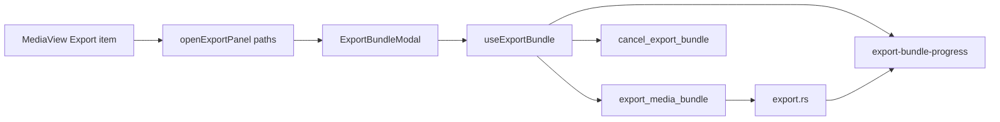

# Export Phase B — B1 Implementation Plan

**Note:** [`.cursor/plans/export phase b ui`](.cursor/plans/) was not found in the repo. This plan follows your locked decisions and the shipped Phase A API in [`src-tauri/src/commands/export.rs`](src-tauri/src/commands/export.rs).

**Checkpoint rule:** Build B1 only, report, wait for approval. Do not start B2–B4 in the same session.

---

## Phase A API (wire to this, not assumptions)

**Invoke shape** (matches [`src/devExportBundle.ts`](src/devExportBundle.ts)):

```ts
invoke("export_media_bundle", {
  options: {
    paths: string[],
    destDir: string,
    includeManifest: boolean,
    playbackEntries: gatherExportPlaybackEntries(paths), // per-media paths
  },
});
```

**Progress event:** `export-bundle-progress` with camelCase payload:

- `phase`: `"preparing"` | `"copying"` | `"writing_manifest"` | `"done"` | `"failed"`
- `currentPath?`, `fileIndex`, `fileTotal`, `bytesCopied`, `bytesTotal?`, `percent?`

**Result:** `destDir`, `filesCopied`, `filesSkipped`, `bytesCopied`, `manifestPath?`, `cancelled`, `warnings[]`

**Cancel:** `cancel_export_bundle()` sets shared cancel flag. **Bug:** line 969 in `export.rs` resets cancel to `false` on every new invoke. **B1 fix:** frontend `exportInFlight` guard blocks a second invoke entirely.

---

## Architecture (B1)



**Runtime state must survive panel close** (re-entry test while export runs). Store export progress/result in Zustand, not only in modal local state.

---

## Files to add

| File | Purpose |
|------|---------|
| [`src/lib/exportSelection.ts`](src/lib/exportSelection.ts) | Extract helpers from dev hook: `flattenGalleryEntries`, `summarizeExportSelection`, sidecar flags (`hasSubs`, `hasChapters`, `hasPreviews`), display label for 1 vs N paths |
| [`src/hooks/useExportBundle.ts`](src/hooks/useExportBundle.ts) | Progress listener, invoke/cancel, `exportInFlight` lifecycle, playback gather |
| [`src/components/ExportBundleModal.tsx`](src/components/ExportBundleModal.tsx) | FSM UI; split subcomponents if configure/running/done exceed ~120 lines each |

---

## Store slice — [`src/store/ruforgeStore.ts`](src/store/ruforgeStore.ts)

Add fields (not persisted via zustand persist middleware):

```ts
exportPanelOpen: boolean
exportPanelPreset: { paths: string[]; label?: string } | null
exportInFlight: boolean
exportProgress: ExportBundleProgressPayload | null
exportOutcome: { kind: "done" | "failed" | "cancelled"; result?: ExportMediaBundleResult; error?: string } | null
```

Actions:

- `openExportPanel(preset)` — sets preset + `exportPanelOpen: true`; if `exportInFlight`, panel opens in running view (no second start)
- `closeExportPanel()` — `exportPanelOpen: false` only; does **not** clear in-flight export
- `setExportInFlight`, `setExportProgress`, `setExportOutcome`, `resetExportOutcome` (on new configure session)

Keep separate from `activeMenu` (gallery context menu).

---

## [`src/hooks/useExportBundle.ts`](src/hooks/useExportBundle.ts)

Pattern: [`src/hooks/useYtdlpUpdate.ts`](src/hooks/useYtdlpUpdate.ts) for `listen` + cleanup.

1. On mount (main window only): subscribe to `export-bundle-progress`, push into store.
2. `startExport({ paths, destDir, includeManifest })`:
   - If `exportInFlight`: return early (optional `notify` warning).
   - Set `exportInFlight: true`, clear prior outcome, reset progress.
   - `playbackEntries = gatherExportPlaybackEntries(paths)` from [`src/exportPlaybackGather.ts`](src/exportPlaybackGather.ts) (unchanged).
   - Await invoke; on resolve set outcome (`cancelled` vs done vs throw).
   - Always clear `exportInFlight` in `finally`.
3. `cancelExport()`: call `cancel_export_bundle`; keep listening until invoke settles.
4. Unlisten on unmount.

**Manifest toggle persistence (B1):** read/write `localStorage` key `ruforge-export-include-manifest`, default `true`. B2 Settings row will reuse the same key.

**Dest picker:** `@tauri-apps/plugin-dialog` `open({ directory: true, multiple: false })` — same as [`SettingsView.tsx` L403–408](src/components/SettingsView.tsx).

---

## [`src/components/ExportBundleModal.tsx`](src/components/ExportBundleModal.tsx)

Mirror [`RegroupPlaylistModal.tsx`](src/components/RegroupPlaylistModal.tsx):

- `fixed inset-0 z-[200]`, centered card, `bg-black/70 backdrop-blur-sm`
- **No backdrop click dismiss**
- Header: title + X (closes in configure / done / failed / cancelled; disabled or hidden while `running`)
- Footer: Cancel + primary Export

**FSM** (derive from `exportInFlight` + `exportOutcome` + local configure fields):

| State | UI |
|-------|-----|
| `configure` | Selection summary (filename from preset), dest folder row + Browse, include-manifest checkbox, Export enabled when dest set and not `exportInFlight` |
| `running` | Phase label, percent/bytes bar from progress event, current file basename (truncated), footer Cancel calls cancel |
| `done` | Summary: dest path, files copied/skipped, manifest path if any, warnings list; Close |
| `failed` | Error message + warnings; Close |
| `cancelled` | Short copy that bundle dir was removed; Close |

**Escape:** `useEffect` keydown — close only in configure / done / failed / cancelled; never while running.

**Primary Export disabled when:** no dest, or `exportInFlight`.

Extract small presentational pieces: `ExportConfigureBody`, `ExportRunningBody`, `ExportOutcomeBody` to stay under AGENTS.md extraction thresholds.

---

## Wiring

### [`src/App.tsx`](src/App.tsx)

Mount next to [`AuthorizeCleanupModal`](src/components/AuthorizeCleanupModal.tsx):

```tsx
<ExportBundleModal />
```

Mount a thin `ExportBundleListener` (or call hook once inside modal with `exportPanelOpen || exportInFlight` guard) so progress listener stays alive if panel closes mid-export.

### [`src/components/MediaView.tsx`](src/components/MediaView.tsx)

After **Generate Previews**, before transcript block (~L532):

- New menu button **Export** (Lucide `FolderOutput` or similar, match existing row styling)
- On click: `openExportPanel({ paths: [file.path], label: file.name })`, `setGalleryActiveMenu(null)`

---

## B1 scope exclusions (defer)

- Settings Downloads row (B2)
- Playlist context menu (B3)
- USB detection / title-bar button (B4)
- `last-dest-dir` prefill (B2)
- Do not remove `__ruforgeDevExportBundle`
- No STATE.md / AGENTS.md Shipped log / version bumps

---

## B1 manual tests (for Angel)

1. Right-click video → Export → panel shows filename.
2. Pick folder → Export → progress bar moves through phases (`preparing` → `copying` → optional `writing_manifest` → `done`).
3. Output: parent dest contains `RuForge Export <timestamp>/` with media + sidecars; manifest when toggle on.
4. Cancel mid-copy → `cancelled` state; bundle folder removed (Rust `cleanup_bundle_root`).
5. **Bug-fix test:** start export, re-open panel or try Export again → blocked by `exportInFlight`; running job not un-cancelled.
6. Escape closes panel in configure/done; Escape does nothing while running.
7. Export with player file open still works (no block).

---

## Later sub-phases (after approval, not in B1)

- **B2:** Settings Downloads `SettingItem` → entire library preset; `ruforge-export-last-dest-dir` prefill
- **B3:** `PlaylistStackCard` context menu; five items; branch `activeMenu` on `entry.kind === 'playlist'`
- **B4:** [`removable_drives.rs`](src-tauri/src/removable_drives.rs) (Windows `DRIVE_REMOVABLE`, 1500ms poll like [`windows_audio_brand.rs`](src-tauri/src/windows_audio_brand.rs)); title-bar USB button in [`WindowControls`](src/App.tsx)

**Playback entries for directory exports (B2/B3):** expand `gatherExportPlaybackEntries` to all media file paths under selected folders via `flattenGalleryEntries` + path prefix match; not required for B1 single-file path.
