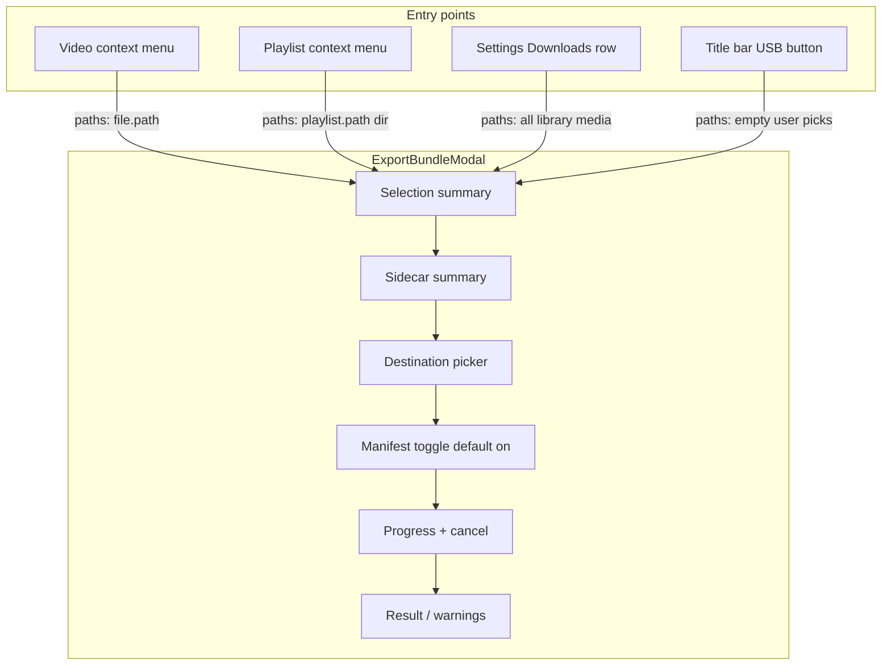
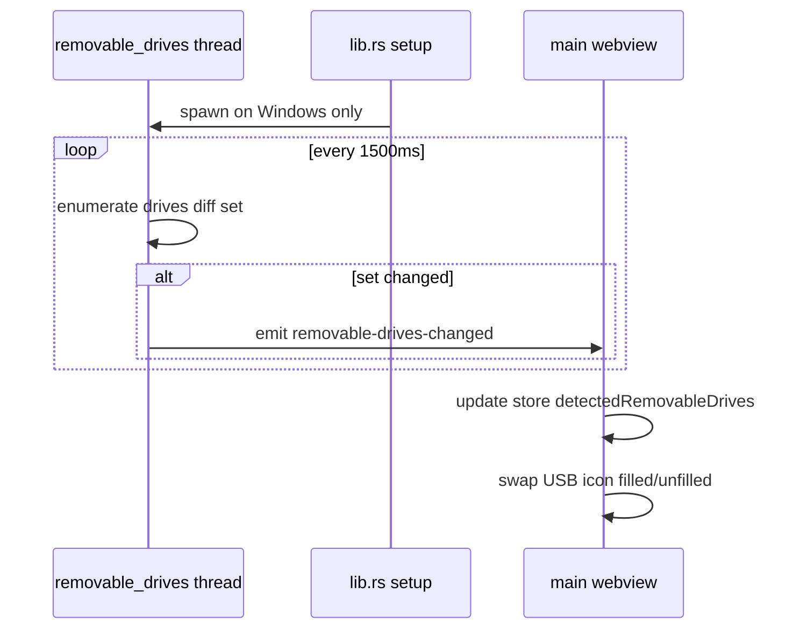

# RuForge Export Phase B: UI, Entry Points, USB Detection

**Status:** Planning only. Phase A is shipped on main (Rust bundler, dev hook). Prior plan files (`RuForge Export Feature`, `export_phase_a_bundler`) were **not found** in-repo or under `~/.cursor/plans`; this doc is grounded in live code + user scope brief.

---

## Findings summary (live code verified)

### Phase A backend (confirmed)

| Item | Location | Notes |
|------|----------|-------|
| `export_media_bundle` | [`src-tauri/src/commands/export.rs`](src-tauri/src/commands/export.rs) L963–984 | Resets cancel flag, runs `spawn_blocking`, returns `ExportMediaBundleResult` |
| `cancel_export_bundle` | same L957–961 | Sets shared `ExportBundleState.cancel` |
| Invoke shape | [`src/devExportBundle.ts`](src/devExportBundle.ts) L92–105 | `invoke("export_media_bundle", { options: { paths, destDir, includeManifest, playbackEntries } })` |
| Playback gather | [`src/exportPlaybackGather.ts`](src/exportPlaybackGather.ts) L14–26 | Reuse as-is; maps paths to localStorage playback state |
| Progress event | `export.rs` L537–553 | Event: **`export-bundle-progress`**. Payload (camelCase): `phase`, `currentPath?`, `fileIndex`, `fileTotal`, `bytesCopied`, `bytesTotal?`, `percent?` |
| Phases | `export.rs` | `"preparing"`, `"copying"`, `"writing_manifest"`, `"failed"`, `"done"` |
| Selection model | `export.rs` L224–277 | **File paths** export one media + sidecars flat; **directory paths** recurse media under folder, preserve subfolder layout, copy `folder.jpg` if present |
| Result | `export.rs` L49–59 | `destDir`, `filesCopied`, `filesSkipped`, `bytesCopied`, `manifestPath?`, `cancelled`, `warnings[]` |
| Frontend listener | grep `src/` | **None yet** |

**Correction vs common assumption:** Tauri invoke wraps args in `{ options: ... }`, not top-level fields.

**Concurrency risk (verified):** Single `ExportBundleState` cancel flag (L17–19). A second `export_media_bundle` while one runs **resets cancel to false** (L969), which can un-cancel the in-flight job. Phase B UI **must** block re-entry while exporting.

### Modal patterns to follow

**Primary precedent:** [`RegroupPlaylistModal.tsx`](src/components/RegroupPlaylistModal.tsx)

- Controlled `open` / `onClose` props (L57–64)
- Early return when closed (L165)
- Overlay: `fixed inset-0 z-[200]`, centered card, `role="dialog"` (L170–174)
- Header X + footer Cancel (L186–193, L246–251)
- **No** backdrop click dismiss, **no** Escape handler (repo-wide: no `Escape` keydown handlers in `src/`)

**Heavy modal precedent:** [`AuthorizeCleanupModal.tsx`](src/components/AuthorizeCleanupModal.tsx)

- Store-driven open: `cleanupModalOpen` + `openAuthorizeCleanupModal` / `closeAuthorizeCleanupModal` in [`ruforgeStore.ts`](src/store/ruforgeStore.ts) L104, L456–465
- Mounted in [`App.tsx`](src/App.tsx) L1610 as app-level sibling
- `z-[200]`, full-viewport (L265–266)

**Recommendation for export:** Hybrid.

- Store slice for `exportPanelOpen` + `exportPanelSelection` (app-wide: USB button, Settings, context menus)
- Component structure mirrors **RegroupPlaylistModal** (centered dialog, not full-screen)
- Mount `<ExportBundleModal />` in `App.tsx` next to `AuthorizeCleanupModal`

### Single-video context menu

**File:** [`MediaView.tsx`](src/components/MediaView.tsx)

- Store: `activeMenu: GalleryContextMenuState` = `{ path, x, y } | null` ([`ruforgeStore.ts`](src/store/ruforgeStore.ts) L54, L241, L599)
- Open: `VideoCard` right-click L125–127; `MoreVertical` L248
- Render: L494–578, `z-[100]`
- Guard: **only** `entry.kind === 'media'` (L509–510)
- Items today: Play Video (L517), Generate Previews (L526), Copy Transcript submenu (L533–564, conditional), Delete (L567)

**Phase B hook:** Add Export row after Generate Previews (before transcript block). On click: close menu, open export panel with `paths: [file.path]`.

### Settings tab + SettingItem

**File:** [`SettingsView.tsx`](src/components/SettingsView.tsx)

- Tabs: `SettingsTab` in [`types.ts`](src/store/types.ts) L19–25
- `SettingItem`: L332–363 (icon, title, description, optional control, `onClick`)
- Directory picker: `handlePickDirectory` L403–408 uses `open({ directory: true, multiple: false })`
- Regroup precedent: debugging tab L996–1009 (`onClick` opens modal)

**Recommended placement:** **Downloads tab**, after Download Path row (after L821). Export is destination-adjacent, not debugging. Row title e.g. "Export media bundle" with `onClick` → open panel with Settings entry (no preselection; see Selection model).

### Dialog plugin (folder picker)

| Check | Status |
|-------|--------|
| npm `@tauri-apps/plugin-dialog` | Present (lock ~2.7.1) |
| Rust `tauri_plugin_dialog::init()` | [`lib.rs`](src-tauri/src/lib.rs) L75 |
| Capability | [`capabilities/default.json`](src-tauri/capabilities/default.json) L45 `"dialog:default"` |
| Existing usage | `SettingsView.tsx` L403–408 only for directories |

**Confirmed wired.** Panel reuses same `open({ directory: true, multiple: false })`.

### WindowControls / title band

**File:** [`App.tsx`](src/App.tsx)

- `WindowControls` inline L92–175: `fixed top-0 right-0 z-[100] h-10`
- Order: Updater → ExplorerWatchQueue (conditional) → Mini Player → divider → min/max/close
- Drag region L1165–1169: `z-[50]`, `right-[200px]` default, `right-[280px]` when explorer toolbar
- [`TitlebarHoverButton.tsx`](src/components/TitlebarHoverButton.tsx): shared icon hit target + tooltip (`z-[220]`)

**USB button placement:** New `TitlebarHoverButton` in `WindowControls` after `ExplorerWatchQueueButton` (L138–142) and before Mini Player (L144). Icons: `tabler:device-usb` idle, `tabler:device-usb-filled` when removable drive detected. **No bundled SVG needed** (Iconify tabler, same as other title-bar icons).

**Drag-region reservation:** Adding one `w-10` button requires bumping drag strip ~40px: e.g. `right-[240px]` / `right-[320px]`. **Open question:** exact pixel budget if updater label width varies; measure after insert.

AGENTS.md rule satisfied: title band `z-[100]`, not explorer tab body.

### Audio-brand polling precedent + Windows crate

**File:** [`windows_audio_brand.rs`](src-tauri/src/windows_audio_brand.rs)

- `AtomicBool` single-start guard (L39–46)
- Named thread `"ruforge-audio-brand"` (L43–45)
- Loop: work → `thread::sleep(1500ms)` (L53–58)
- Spawned from `lib.rs` setup L92–100, `#[cfg(windows)]` only

**Drive APIs:** Not in repo. [`Cargo.toml`](src-tauri/Cargo.toml) L47–54 enables `Win32_Foundation`, Media, Com, ToolHelp, UI Shell. **`Win32_Storage_FileSystem` is NOT enabled** (required for `GetLogicalDrives` / `GetDriveTypeW` / `DRIVE_REMOVABLE` in `windows::Win32::Storage::FileSystem`).

### Sidecar summary (UI-only)

Rust copies per [`collect_sidecar_sources`](src-tauri/src/commands/export.rs) L387–415: `.jpg`/`.webp`, `.info.json`, `..info.json`, `.sponsorblock.json`, `.comments.json`, all VTT langs, plus recursive `.ruforge_thumbs/{stem}/`.

Frontend inference from `MediaFile` ([`types.ts`](src/types.ts) L1–17): `subtitlePath`, `chapters`, `ruforgePosterPath`, `thumbnailPath`. SponsorBlock/comments not on `MediaFile`; show as "if present on disk" generic line. Reuse flag pattern from [`devExportBundle.ts`](src/devExportBundle.ts) L40–54 (`mediaFlags`).

---

## Proposed playlist context menu (for Angel approval)

Grounded in **existing** handlers only. Export is in scope; others are proposals.

| Item | Action | Handler / command | Status |
|------|--------|-------------------|--------|
| **Open** | Navigate to playlist detail | `onPlaylistClick(playlist)` ([`MediaView.tsx`](src/components/MediaView.tsx) L468–471) | Supported |
| **Play All** | Start queue from item 1 | `handlePlayPlaylist(playlist.items)` ([`ruforgeStore.ts`](src/store/ruforgeStore.ts) L312–328) | Supported |
| **Shuffle** | Shuffled queue | `handlePlayPlaylist(playlist.items, true)` | Supported |
| **Export bundle** | Export folder + sidecars | Open panel with `paths: [playlist.path]` (directory selection) | **Phase B (required)** |
| **Open folder** | Reveal playlist folder in OS file manager | `invoke("open_external_url", { url: playlist.path })` ([`system.rs`](src-tauri/src/commands/system.rs) L7–12) | Supported (trivial wrapper) |
| **Delete all videos** | Remove every item in stack | Loop `delete_media` + existing delete cleanup ([`MediaView.tsx`](src/components/MediaView.tsx) L287–321) | Frontend-only, **high UX risk** (partial failures, no atomic folder delete). **Defer** from Phase B menu |
| **Rename playlist** | Rename folder/title | No command | **Defer** (net-new backend) |
| **Regroup** | Move flat files into folder | `regroup_playlist_downloads` via [`RegroupPlaylistModal`](src/components/RegroupPlaylistModal.tsx) | Wrong UX from stack card (expects URL + flat files). **Do not add** |

**Honest minimum for Phase B playlist menu:** Open, Play All, Shuffle, Export, Open folder (5 items). Matches [`RuForge.md`](../RuForge.md) L124 backlog minus Rename/Delete until backend exists.

**Implementation note:** Net-new menu on `PlaylistStackCard` ([`MediaView.tsx`](src/components/MediaView.tsx) L34–80). Extend `activeMenu` renderer (L508+) to branch `entry.kind === 'playlist'`. Add `onContextMenu` on stack card (currently click-only L46). Style matches existing media menu (L501–507).

`PlaylistDetailView` L170–172 `MoreVertical` is a **separate** dead button; out of Phase B scope unless Angel wants per-item menus later.

---

## Export panel design

### Selection model



| Entry | Preselection | User can change? |
|-------|--------------|------------------|
| Single video | `[file.path]` | No (re-open from another file) |
| Playlist | `[playlist.path]` (directory) | No |
| Settings | All library media paths via `flattenGalleryEntries(entries)` from [`devExportBundle.ts`](src/devExportBundle.ts) L28–37 | **MVP:** read-only "Entire library (N files)". **Stretch:** checklist subset (cleanup-modal pattern). Recommend MVP for B2. |
| USB button | Empty / last-used dest pre-filled | User must confirm selection if empty; if opened from USB with no prior context, default to **entire library** OR show empty state prompting context menu export. **Recommend:** USB button opens panel with **no paths** + copy "Select items from library or use a video/playlist menu"; optional quick "Export entire library" button inside panel. |

**Playback entries:** Always `gatherExportPlaybackEntries(resolvedMediaPaths)` where `resolvedMediaPaths` = flat list of media file paths (for directory export, expand playlist items client-side from store; Rust also expands dirs).

**Persist last destination:** New `localStorage` key `ruforge-export-dest-dir` (not in persist slice). USB one-tap sets dest when drive detected. **Open question:** persist manifest toggle default?

### Panel states (UI FSM)

1. **configure** — selection summary, sidecar blurb, dest, manifest toggle, Export CTA
2. **running** — progress bar from `export-bundle-progress`, phase label, current file (truncate), Cancel → `cancel_export_bundle`
3. **done** — files copied/skipped, bytes, dest path (copyable), warnings list, "Open folder" via `open_external_url`, Close
4. **failed** — error string, Close (no partial result if `Err`)
5. **cancelled** — result with `cancelled: true`, bundle cleaned up server-side

Disable dismiss (X / Cancel) while running except via explicit Cancel export.

### Sidecar summary block

Static template + per-selection counts:

- "Each video copies: media file, info JSON, subtitles (all langs), thumbnail, SponsorBlock/comments sidecars if present, scrub preview folder."
- Dynamic: "Exporting **1 video**" / "**12 videos** from playlist **Title**" / "**N videos** from library"
- Optional chips from `mediaFlags` aggregate: "Subtitles: 8/12", "Chapters: 10/12", "Previews: 6/12"

### Destination UI

- Text field showing chosen path (truncated middle)
- **Choose folder…** → dialog plugin
- **Detected USB** pill when `removableDrives.length > 0` (one-tap sets `destDir` to drive root, e.g. `E:\`)
- If multiple removables, show picker row or first drive + dropdown (**open question**)

### Dismiss behavior

Match RegroupPlaylistModal: header X, footer Cancel in configure state; no backdrop click. Consider adding **Escape → close** in configure/done only (improvement over existing modals; flag for Angel).

---

## USB detection architecture (Phase C pulled into B)



**New Rust module:** `src-tauri/src/removable_drives.rs` (name TBD)

- `#[cfg(windows)]` only implementation
- `GetLogicalDrives()` bitmask → test `DRIVE_REMOVABLE` via `GetDriveTypeW`
- Build `Vec<RemovableDrive { path, letter }>` (mount path like `E:\`)
- Compare to last snapshot; emit **`removable-drives-changed`** only on diff
- Poll interval: **1500ms** (match audio brand)
- Spawn from `lib.rs` setup alongside audio brand (L92–100)

**Non-Windows:** No thread. Frontend initializes `detectedRemovableDrives: []`. USB button still renders; click opens export panel only.

**Cargo.toml:** Add `"Win32_Storage_FileSystem"` under `[target.'cfg(windows)'.dependencies.windows.features]`.

**No new Tauri command required** if event-only; optional `list_removable_drives` sync command for debugging.

---

## Phase B internal breakdown

### B1 — Panel core + single-video entry (lowest risk, E2E first)

**Build:**

- `src/components/ExportBundleModal.tsx` — modal UI + FSM
- `src/hooks/useExportBundle.ts` — invoke, `listen('export-bundle-progress')`, cancel, unlisten on unmount
- `src/lib/exportSelection.ts` — flatten gallery entries, resolve selection labels, sidecar summary helpers (extract from devExportBundle patterns)
- Store: `exportPanelOpen`, `exportPanelPreset: ExportPanelPreset | null`, open/close actions
- [`App.tsx`](src/App.tsx) — mount modal
- [`MediaView.tsx`](src/components/MediaView.tsx) — context menu Export item

**Files touched:** new 3–4 TS files, `ruforgeStore.ts`, `types.ts`, `App.tsx`, `MediaView.tsx`

**Difficulty:** Medium | **Risk:** Low–medium (progress listener lifecycle, invoke arg shape)

**Verify:**

1. Right-click video → Export → panel shows filename
2. Pick folder → Export → progress bar moves
3. Output matches Phase A dev export (`RuForge Export <timestamp>/`, sidecars, manifest when toggled on)
4. Cancel mid-copy → `cancelled: true`, bundle dir removed
5. Cannot start second export while running

---

### B2 — Settings entry + last-dest persistence

**Build:**

- [`SettingsView.tsx`](src/components/SettingsView.tsx) — Downloads tab `SettingItem` row
- Opens panel with entire-library selection (flatten entries)
- `localStorage` last dest dir; pre-fill on open

**Difficulty:** Low | **Risk:** Low (large libraries: many paths in one invoke; **open question** on performance ceiling)

**Verify:**

1. Settings → Downloads → Export row → panel shows "N files"
2. Export entire library to chosen folder
3. Re-open panel → remembers last destination

---

### B3 — Playlist context menu (highest UI risk)

**Build:**

- `PlaylistStackCard` `onContextMenu` + menu branch in MediaView global menu block
- Menu items: Open, Play All, Shuffle, divider, Export, Open folder
- Export → `paths: [playlist.path]`

**Files touched:** `MediaView.tsx`, possibly `ruforgeStore.ts` if menu state typing extended

**Difficulty:** Medium | **Risk:** **High** (net-new menu surface, z-index stacking with existing media menu, only one `activeMenu` at a time)

**Verify:**

1. Right-click playlist stack card → menu appears (not conflated with media menu)
2. Play All / Shuffle behave same as detail view
3. Export copies numbered subfolder structure (Rust dir mode)
4. Open folder launches Explorer at playlist path

---

### B4 — USB detection + title-bar button (highest systems risk)

**Build:**

- `src-tauri/src/removable_drives.rs` + `mod` in `lib.rs`
- `Cargo.toml` feature `Win32_Storage_FileSystem`
- Store: `detectedRemovableDrives: string[]`, listener in `App.tsx` or dedicated hook
- `WindowControls` USB button + drag-region width tweak

**Difficulty:** Medium–high | **Risk:** **High** (Win32 edge cases: SD readers, multiple removables, empty drives, permission; false positives on non-USB removable)

**Verify:**

1. Plug USB → icon fills within ~2s
2. Unplug → icon unfilled
3. Click USB → export panel opens; one-tap USB dest works
4. Linux/macOS dev: button visible, no crash, no detection thread

---

## Store slice sketch

Add to [`ruforgeStore.ts`](src/store/ruforgeStore.ts):

```typescript
type ExportPanelPreset =
  | { kind: "files"; paths: string[]; label: string }
  | { kind: "directory"; path: string; label: string }
  | { kind: "library"; label: string }; // resolves via flatten at open time

exportPanelOpen: boolean;
exportPanelPreset: ExportPanelPreset | null;
exportInFlight: boolean; // guard concurrent invokes
detectedRemovableDrives: string[];

openExportPanel: (preset: ExportPanelPreset) => void;
closeExportPanel: () => void; // blocked when exportInFlight unless cancelling
```

Keep **`activeMenu`** separate from export panel (different concerns).

---

## What Phase B must NOT do

- **Cloud / webview export** (Phase D)
- **Manifest import** on another machine (later)
- **Native hotplug** (WM_DEVICECHANGE); polling only per spec
- **Resume partial exports** beyond Phase A skip-if-exists (no UI for resume picking)
- **Rename / delete playlist** menu items without backend
- **Mini player** export entry (main window only; match dev hook guard in [`devExportBundle.ts`](src/devExportBundle.ts) L84–89)

---

## Open questions (do not guess in implementation)

1. **Prior plan docs missing** — Confirm Phase C/D scope still matches maintainer intent outside this doc.
2. **Settings selection UX** — Entire library only for MVP, or ship multi-select checklist in B2?
3. **USB button with empty selection** — Entire library default vs empty state vs last export selection?
4. **Multiple removable drives** — First only, dropdown, or list in panel?
5. **Persist `includeManifest` default** across sessions?
6. **Escape key** — Add to export modal only, or align all modals?
7. **Drag-region pixel math** — Fixed bump vs dynamic measurement from `WindowControls` ref.
8. **Large library export** — Any max path count or warn above N files?
9. **Export while player has file open** — Block, warn, or allow (delete flow has "in use" handling)?
10. **`GetDriveTypeW` false positives** — Treat `DRIVE_REMOVABLE` only, or also `DRIVE_FIXED` on some USB enclosures? Needs device testing.

---

## Post-ship housekeeping (after implementation, not part of plan execution)

- Append AGENTS.md Shipped log + STATE.md under v0.1.9
- Remove or gate dev-only `installDevExportBundleTest` if redundant with UI (**open question**)
- Jim pass optional for panel visuals only (logic in Chad scope per AGENTS.md)

---

## Suggested file manifest

| File | Action |
|------|--------|
| `src/components/ExportBundleModal.tsx` | **New** |
| `src/hooks/useExportBundle.ts` | **New** |
| `src/lib/exportSelection.ts` | **New** |
| `src/store/ruforgeStore.ts` | Extend |
| `src/store/types.ts` | Export preset types if needed |
| `src/App.tsx` | Mount modal, USB listener, WindowControls button, drag region |
| `src/components/MediaView.tsx` | Video + playlist menus |
| `src/components/SettingsView.tsx` | Export row |
| `src-tauri/src/removable_drives.rs` | **New** (Windows) |
| `src-tauri/src/lib.rs` | Spawn thread, mod |
| `src-tauri/Cargo.toml` | Win32_Storage_FileSystem |

**Reuse unchanged:** `exportPlaybackGather.ts`, `export.rs`, dialog plugin wiring.
