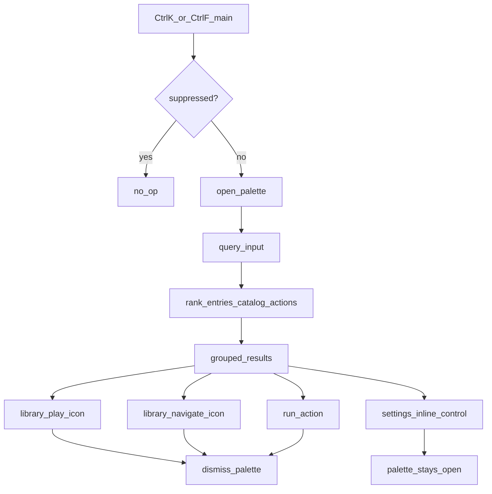

# RuForge Global Search Plan

**Status:** Planning only. No app code until Angel says implement.  
**Accepted shape:** V1 launcher/command palette over Library + Settings + Actions, client-side over the in-memory snapshot. YouTube is optional V2 (later phase). Build after main-app nav restructure. Do not re-litigate that.

---

## Verdict

Ship a main-window palette (**Ctrl+K** and **Ctrl+F**) that finds local library items, edits settings in place, and runs app actions. It reinforces the downloader + local library wedge. It is not OS Spotlight, not Raycast, and not an in-app YouTube browser.

---

## User promise and non-goals

**Promise:** From the main window, one shortcut finds a local track or video, a setting you can change without leaving the palette, or a navigation action, then runs it.

**Non-goals (V1/V2):** OS file search outside scan roots, plugins, Companion search, streaming YouTube inside the palette, a second Explore surface, mini-window palette.

**What V2 means:** a later optional YouTube results group inside the same palette (not part of first ship). Remote hits; pick one to download or open in Explore. V1 ships with zero YouTube search.

---

## Locked decisions (holes)

### 1. Explore z-index

**Decision: suppress the palette shortcut while a covering Explore child webview is active.** Do not render the palette in the title band. Do not invent content-column chrome over the webview.

**Proof:**

- [`AGENTS.md`](../../../AGENTS.md) Explorer chrome rule: child webview paints on top of main-column DOM; only valid chrome is the top title band at the WindowControls layer.
- [`src/components/ExplorerTitlebarNav.tsx`](../../../src/components/ExplorerTitlebarNav.tsx): comment that the embedded explorer webview covers in-tab DOM; chrome is `fixed` + `z-[100]` title band only.
- [`src/App.tsx`](../../../src/App.tsx): main Explore when `activeTab === "explorer"`; hide path uses `explorerWebviewRef.current.hide()` / `set_embedded_explorer_visible`.
- [`src/components/music/MusicShell.tsx`](../../../src/components/music/MusicShell.tsx) + [`src/explorerProfileScript.ts`](../../../src/explorerProfileScript.ts): second covering surface `music-explore-view` while Music Explore is active (`exploreWebviewActive`).

**Suppress when either:**

- `activeTab === "explorer"`, or
- Music mode Explore webview active (`musicView === "explore"` and the music explore webview is shown).

**V2 consequence:** Selecting a YouTube hit that opens Explore must **close the palette first**, then show/navigate Explore. Primary V2 action is **Downloader prefill** (palette stays useful). "Open in Explore" is secondary and ends the palette session; user cannot reopen the palette until they leave that Explore surface.

### 2. Two webviews

**Decision: palette shortcuts do not exist in mini player windows at all** (`mini` and `music-mini`). No emit/listen bridge for palette open or selection.

**Proof:**

- [`AGENTS.md`](../../../AGENTS.md): Zustand does not span webviews; cross-window sync is Tauri emit/listen only.
- [`src/App.tsx`](../../../src/App.tsx): `miniKind === "video"` → `MiniPlayer`; `miniKind === "music"` → `MusicMiniPlayer`; palette mounts only on the main tree after that gate.
- [`src/MiniPlayer.tsx`](../../../src/MiniPlayer.tsx): keydown is seek/space only; library there is a local `useState` mirror, not a reason to own global search.

### 3. Settings registry and in-palette controls

**Decision: extract one shared settings catalog. `SettingsView` and the palette both consume it. No second keyword list.**

**Angel product lock:** Settings hits are **editable inside the palette**. Selecting a setting does **not** open or navigate to the Settings popup. Toggle / choice / simple controls run against the same store setters Settings already uses. Complex panels (trees, multi-step) either get a compact in-palette control or are Actions that open Settings only when in-palette edit is impractical; default is in-palette.

**Shape:**

- New module e.g. [`src/lib/settingsSearchCatalog.ts`](../../../src/lib/settingsSearchCatalog.ts): rows `{ id, tab, title, description, keywords, control }` plus shared `settingsTextMatches`. `control` describes the in-palette widget (boolean toggle, enum, etc.) and store bind path.
- [`src/components/SettingsView.tsx`](../../../src/components/SettingsView.tsx) today: component-local `searchQuery`, `settingsTextMatches`, and inline `SettingItem` title/description/keywords. Move match helper + searchable strings + control metadata into the catalog; Settings UI and palette both render from it.
- Palette Settings group renders the control inline (icons where the control needs them). No `openSettings()` on normal settings hits.

**Drift cost of two lists (forbidden):** a row searchable in Settings but missing in the palette (or the reverse); keywords diverge; new settings ship half-indexed. That is a product bug, not a cleanup ticket.

### 4. Shortcut ownership

**Decision: single owner is a main-window hook mounted from `App.tsx`, e.g. `useGlobalSearchPalette`, capture-phase keydown for Ctrl+K and Ctrl+F (Windows). Both open the same palette. `preventDefault` so the webview find-in-page does not steal Ctrl+F. Alt radial stays Alt-only in `useAltRadialNav`.**

**Proof / neighbors:**

- [`src/hooks/useAltRadialNav.ts`](../../../src/hooks/useAltRadialNav.ts): Alt hold; already skips `isTypingTarget()` (INPUT/TEXTAREA/SELECT/contentEditable).
- [`src/App.tsx`](../../../src/App.tsx): `useAltRadialNav(shellBlocked)` on main tree only.
- [`src/components/music/MusicShell.tsx`](../../../src/components/music/MusicShell.tsx): Ctrl+B and Alt+1/2/3; must not steal Ctrl+K / Ctrl+F.

**Suppressed when:**

- `shellBlocked`
- typing target (same rules as radial `isTypingTarget`)
- main Explore active (`activeTab === "explorer"`)
- Music Explore covering webview active
- mini windows (hook not mounted)

**Dismiss:** Escape, backdrop click, successful library play/navigate, successful action, or starting an Explore navigation from a V2 result. Changing a setting in-palette does **not** require dismiss (palette stays open unless the user closes it). Opening the palette closes the Alt radial if open. Focus moves into the palette query field; radial will not fire Alt while that field is focused.

### 5. Source of truth (library)

**Decision: one array for data. Palette has one ranker. Media / MusicHome in-view filters keep current `includes()` matching (mirrors do not share the fuzzy ranker).**

**Proof:**

- [`src/store/ruforgeStore.ts`](../../../src/store/ruforgeStore.ts): single `entries: GalleryEntry[]` from `get_library_snapshot`.
- [`src/components/MediaView.tsx`](../../../src/components/MediaView.tsx): `entries` + `searchValue` title filter.
- [`src/components/music/MusicHomeView.tsx`](../../../src/components/music/MusicHomeView.tsx): `flattenGalleryScanToMediaFiles(entries).filter(isAudioOnlyPath)`.
- [`src/components/PlayerView.tsx`](../../../src/components/PlayerView.tsx): same `entries` split by `isAudioOnlyPath`.

Palette Library group ranks flattened media from `entries` once, tagged audio vs video. Same query string may rank differently in the palette than in Media/MusicHome `includes()` filters; that is accepted for V1.

### 6. Consolidation (tied to nav restructure)

Nav restructure ([`STATE.md`](../../../STATE.md) Next 3): RuForge | Movies & Shows | Music + `MoviesShowsShell`. Palette lands after that shell exists so jump targets match real modes.

| Surface | Decision |
|---------|----------|
| MediaView / MoviesShowsShell in-view filter (`searchValue` bulge) | **Keep as mirror** with existing `includes()`. In-grid narrowing while browsing stays. |
| MusicHomeView local search | **Keep as mirror** with existing `includes()`. Empty-state "search YouTube Music" Explore handoff stays until V2. |
| Settings popup search field | **Replace data path.** Field stays; matching + row metadata come from the shared catalog. Palette edits use the same catalog controls. |

---

## V1 scope

**Groups (ranked):**

1. **Library** — from `entries` (title, artist, album, basename). Each hit shows two icon buttons: **Play** (play immediately) and **Navigate** (go to the item in Library / Music without playing). Row click defaults to **Play**. Use lucide (or existing app icon set) Play and Folder/Arrow style icons; Jim may refine later.
2. **Settings** — catalog rows with **in-palette controls**. No trip through the Settings popup for normal rows.
3. **Actions** — static registry in e.g. `src/lib/globalSearchActions.ts`: open Downloader, Media/MoviesShows, Music Home, Music Library, Explorer (leaves palette; Explore suppress applies after), Storage cleanup, Mini player, cycle mode, open Settings popup (explicit action only), etc.

**Out of V1:** YouTube query results (that is V2), Downloads job search (unless a one-liner over existing queue state is free; not required), stats/debug, Rust search index, Companion.

**Fuzzy (implementation detail, do not add until build):** preferred default **`match-sorter`**. At build time, verify current maintenance status before adding to `package.json`; swap if stale. Wire only at implement time.

**Visuals:** Chad ships behavior + structure + icon affordances. Jim polish after.

---

## V1 technical approach

**Likely files (implement later):**

- `src/hooks/useGlobalSearchPalette.ts` — Ctrl+K / Ctrl+F, suppress rules, open state
- `src/components/global-search/GlobalSearchPalette.tsx` — overlay UI (use `OVERLAY_Z_CLASS` from [`src/lib/overlayZIndex.ts`](../../../src/lib/overlayZIndex.ts); still useless under Explore, hence suppress)
- `src/lib/settingsSearchCatalog.ts` — shared settings rows, match helper, control metadata
- `src/lib/globalSearchActions.ts` — action registry
- `src/lib/globalSearchRank.ts` — single ranker over library + catalog + actions (palette only)
- Wire mount in [`src/App.tsx`](../../../src/App.tsx) on main only
- Refactor [`SettingsView.tsx`](../../../src/components/SettingsView.tsx) onto catalog

No new Rust commands for V1.

---

## V2 YouTube bucket (later, not V1)

- Separate group, opt-in chip or toggle inside the open palette.
- Backend: yt-dlp search via existing downloader command patterns in [`src-tauri/src/commands/downloader.rs`](../../../src-tauri/src/commands/downloader.rs); cookie-aware like `get_video_info`. Exact invoke shape verified at implement time.
- **Primary select (locked): Downloader-first** — prefill Downloader + start info fetch (palette closes; user stays in main DOM).
- **Secondary select:** close palette, then open main Explore or Music Explore and navigate (suppress applies afterward). Icon for secondary; primary can be row activate or a download icon.
- Not: stream in palette. Not: infinite browse.

---

## Explicitly later / never

**Later:** Rust index for huge libraries, download-job search, queue/playlist search, recents, Companion, stats/debug surfaces.  
**Never (as product center):** OS-wide omni-search, plugin marketplace, YouTube-first pitch copy.

---

## Sequencing vs current Next 3

From [`STATE.md`](../../../STATE.md):

1. Discord Rich Presence staleness guard (blocks public Discord ship)
2. Storage cap before enqueue
3. Main-app nav restructure
4. **Then Global Search V1**

Do not cut in front of 1–3. Nav restructure first so Actions and Library targets match MoviesShowsShell + Music modes.

---

## Risks

- Forgetting suppress on Music Explore (`music-explore-view`) while fixing only main Explorer.
- Building a second settings keyword list "temporarily."
- In-palette settings controls drifting from SettingsView behavior if they do not share catalog + store setters.
- Palette focus stealing from URL/downloader inputs if typing-target suppress is incomplete.
- Ctrl+F fighting webview find-in-page if `preventDefault` is missing.
- Treating mini-window library UI as a second search product.

---

## Product calls (resolved)

1. **Settings:** edit in the palette. Do not open Settings for normal hits.
2. **Library:** Play and Navigate, both with icons. Row default = Play.
3. **V2 primary:** Downloader-first.
4. **Shortcuts:** Ctrl+K and Ctrl+F both open the palette (same suppress rules).

---

## Manual acceptance checklists

### V1 (Angel click-through)

1. Main window, Media or Music Home, not in a text field: Ctrl+K and Ctrl+F each open the palette; Ctrl+F does not open webview find-in-page.
2. Query finds a local video and a local audio track from the same library snapshot; Play icon plays; Navigate icon goes to the item without playing.
3. Query finds a Settings row (e.g. Discord toggle); changing it in the palette updates the real setting without opening the Settings popup.
4. An Action result switches mode/tab (e.g. Downloader).
5. Focus in Downloader URL field or Music Home search: Ctrl+K / Ctrl+F do not open the palette.
6. Main Explore tab: shortcuts do not open; title-band chrome still works.
7. Music Explore view with webview showing: shortcuts do not open.
8. Video mini and music-mini windows: shortcuts do nothing.
9. Esc and backdrop dismiss; Alt radial still works when palette is closed and not typing.
10. Settings popup search and palette Settings hits stay aligned after adding one keyword on a row (one catalog edit updates both).

### V2 (later)

1. With YouTube bucket enabled, a query returns remote hits without Explore already open.
2. Primary select lands in Downloader with URL/info fetch.
3. Secondary Open in Explore closes palette, then shows Explore at the target; palette shortcuts remain suppressed until Explore is left.

---

## Done line

V1 is done when the checklist above passes on a build after nav restructure, with one settings catalog (in-palette controls), one palette `entries` ranker, main-only Ctrl+K/Ctrl+F, Play+Navigate library affordances, and Explore surfaces suppressed.
