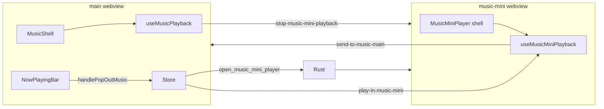

# RuForge Music Mini Player (separate window)

**Status:** Planning only. Do not edit [`src/MiniPlayer.tsx`](src/MiniPlayer.tsx) for music pop-out work. That file remains the video/default mini (~2,800 lines). This plan adds a parallel stack under `src/components/music-mini/`.

**Goal:** Music mode pop-out opens a **second** mini window optimized for local audio: smaller codebase, music visual language, new resize behavior, simplified chrome. Zero shared React root with video mini.

---

## Problem statement

Today, `navMode === "music"` pop-out uses the same path as video:

- [`ruforgeStore.ts`](src/store/ruforgeStore.ts) `handlePopOut` → `invoke("open_mini_player")` → event `play-in-mini` with optional `navMode: "music"`.
- [`App.tsx`](src/App.tsx) label `mini` → [`MiniPlayer.tsx`](src/MiniPlayer.tsx).
- Music styling is a branch (`data-music-mode`, `miniNavMode`) inside a component built for video (SponsorBlock, subtitles, chapter scrubber, in-window media library, gallery resize snap, etc.).

Changing music mini appearance or resize inside `MiniPlayer.tsx` risks regressions on the shipped video mini. The fix is isolation: new window label, new files, new events.

---

## Architecture (target)



| Concern | Video mini (unchanged) | Music mini (new) |
|--------|-------------------------|------------------|
| Tauri window label | `mini` | `music-mini` |
| Rust open command | `open_mini_player` | `open_music_mini_player` |
| Root component | `MiniPlayer` | `MusicMiniPlayer` |
| Handoff event | `play-in-mini` | `play-in-music-mini` |
| Return to main | `send-to-main` | `send-to-music-main` |
| Stop from main | `stop-playback` → `mini` | `stop-music-mini-playback` → `music-mini` |
| localStorage volume | `miniplayer-volume` (keep) | `music-mini-volume` (new, optional sync policy below) |
| Zustand | Not in mini webview | Not in music-mini webview (same invariant) |

**Volume sync policy (decide at M2, default recommended):** On handoff, pass `volume` / `muted` in payload (mirror [`PlayInMiniPayload`](src/playerHandoff.ts)). Music mini persists to `music-mini-volume` only. Do not read `miniplayer-volume` in music mini code paths.

---

## Chrome spec (product)

Top bar layout (music mini only). Reference for Jim; logic in M4.

| Control | Present | Notes |
|---------|---------|-------|
| Library / media selector (tabler:library, top-left) | **No** | Video mini keeps this; music mini does not embed a browse surface |
| 8-dot drag affordance (center) | **Yes** | Same visual pattern as video mini center grid ([`MiniPlayer.tsx`](src/MiniPlayer.tsx) ~L1550-1552); `startDragging()` on flex drag strip |
| Drag strip (pointer-events on title band) | **Yes** | Same Tauri API as today |
| Back to main app | **Yes** | Emits `send-to-music-main` with file + time + paused + speed + volume; focuses `main`; closes `music-mini`. Label/tooltip: **Back to RuForge** or **Back to library** (pick one in Jim pass; means main MusicShell, not mini library) |
| Pin / always on top | **Yes** | `music-mini-pinned` in localStorage; hover-to-front behavior can match video mini if desired (see [`MiniPlayer.tsx`](src/MiniPlayer.tsx) `setAlwaysOnTop` on enter/leave) |
| Close | **Yes** | Closes window only; does not hand off unless user used Back |
| Windows Sound Settings | **No** | Video-only affordance today |
| Shuffle / in-mini queue UI | **Out of scope v1** | Queue lives on main `MusicShell`; mini plays current track + advance via shared advance helpers |

**Appearance:** `[data-music-mode="true"]` on music-mini root only. Tokens from [`index.css`](src/index.css) music block (`--music-bg`, `--music-accent`, surfaces). No default-mode brown accent in music mini. Cover: `object-fit: cover`, gradient fade on compact widths (match shipped music mini cover rules in STATE.md, not video letterbox).

**Buttons (transport, v1 minimum):** Play/pause, prev/next track (wire to same semantics as [`useMusicPlayback`](src/components/music/useMusicPlayback.ts) skipPrev/skipNext), optional ±15s if main bar has them. No SponsorBlock skip button. No subtitle menu. No speed menu in v1 unless trivial (can mirror main speed from handoff payload).

---

## Resize logic (new, not a port of video mini)

Video mini resize is entangled with:

- Many breakpoints (`isSmallMode`, `isCompactMode`, `isMicroMode`, `isTinyMode`, etc.).
- Fixed **library** window size when media selector opens ([`MiniPlayer.tsx`](src/MiniPlayer.tsx) ~L600-628).
- Video aspect and SponsorBlock scrub regions.

Music mini should define a **small, explicit** size model in one hook file.

### Proposed tiers (`useMusicMiniResize.ts`)

| Tier | Trigger (example) | Window behavior | UI |
|------|-------------------|-----------------|-----|
| `expanded` | width >= 380 and height >= 280 | User-resizable; min ~320x200; max none | Full chrome, scrub, metadata two-line |
| `compact` | height < 280 or width < 380 | Resizable within band; min ~280x120 | Hide nonessential chrome; smaller art |
| `bar` | height < 100 | Optional fixed height snap at ~72-88px | Art strip + play/pause + scrub dots only; title bar may hide 8-dot row per micro mode |

Implementation notes:

- Listen to `getCurrentWindow().onResized` (or existing pattern from video mini `winSize` state) once in the hook; export `{ tier, width, height }` only.
- **Do not** call `setMaxSize` / lock size for a library panel (music mini has no library).
- Optional: remember last expanded size in `music-mini-bounds` JSON in localStorage (restore on open). Video mini does not need this parity.
- Clip-path rounded corners: keep transparent undecorated window + `clip-path: inset(0 round 1.5rem)` on root (same product shape as video mini).

Document final pixel thresholds after first Jim mock; table above is the contract to implement against.

---

## File layout (line budget)

Hard rule: **no file in `src/components/music-mini/` should exceed ~200 rendered lines** (hooks excluded if pure logic). Split early.

```
src/
  playerHandoff.ts                    # extend: PlayInMusicMiniPayload, SendToMusicMainPayload
  components/
    music-mini/
      MusicMiniPlayer.tsx             # shell: providers, layout, event listeners (~80 lines)
      MusicMiniTitleBar.tsx           # drag, 8-dot, pin, back, close
      MusicMiniCover.tsx              # art + gradient scrim
      MusicMiniTransport.tsx          # play, prev, next, optional skip
      MusicMiniScrubber.tsx           # thin progress bar (not ChapterScrubber)
      useMusicMiniPlayback.ts         # audio element, handoff, ended → advance
      useMusicMiniResize.ts           # tier breakpoints
      useMusicMiniWindowChrome.ts     # pin, hover always-on-top, transparent body
      musicMiniConstants.ts           # LS keys, size mins
  App.tsx                             # + branch: label music-mini → MusicMiniPlayer
src-tauri/
  src/commands/player.rs              # + open_music_mini_player
  src/lib.rs                            # register command
```

Optional shared **presentational** imports from existing libs (safe, no coupling):

- [`formatDuration`](src/components/downloader/downloaderFormat.ts)
- [`playbackStorage`](src/playbackStorage.ts) read/write position
- [`applyMediaOutputState`](src/applyMediaOutputState.ts)
- [`musicAdvanceQueue`](src/components/music/musicAdvanceQueue.ts) for ended → next track
- [`isAudioOnlyPath`](src/mediaKind.ts) guard on handoff

**Do not import** from `MiniPlayer.tsx` or share a parent component.

---

## Rust: `open_music_mini_player`

Mirror [`open_mini_player`](src-tauri/src/commands/player.rs):

- Label: `"music-mini"`.
- Title: `"RuForge Music"` (or product string).
- Initial size: suggest **380 x 280** (music cover-forward; smaller than video 480x320).
- Same: `decorations(false)`, `transparent(true)`, `shadow(false)`, hardware accel args.
- If window exists: `set_focus()` only.

Register in [`lib.rs`](src-tauri/src/lib.rs) and expose to frontend `invoke("open_music_mini_player")`.

Capabilities: same as `mini` (no new permission expected if same webview capabilities).

---

## Main window wiring

### Store

Add **`handlePopOutMusic`** (or branch inside `handlePopOut` that early-returns when `navMode === "music"`). Recommended: **separate action** so video `handlePopOut` diff stays zero.

Music pop-out payload should include everything music main needs on return:

```ts
type PlayInMusicMiniPayload = {
  file: MediaFile;
  startTime: number;
  paused?: boolean;
  playbackSpeed?: number;
  volume?: number;
  muted?: boolean;
  // Optional v2: manualQueue snapshot, effectivePlaylist index
};
```

On success: clear main music playback element state (same as today clearing `playingFile` for video: pause main `<audio>` in `MusicShell`, do not destroy queue state in store).

### [`NowPlayingBar.tsx`](src/components/music/NowPlayingBar.tsx)

Pop-out control calls `handlePopOutMusic` instead of `handlePopOut`.

### [`useMusicPlayback.ts`](src/components/music/useMusicPlayback.ts)

Replace:

```ts
emitTo("mini", "stop-playback", "main-app")
```

with:

```ts
emitTo("music-mini", "stop-music-mini-playback", "main-app")
```

On mount/unmount cleanup only targets music-mini.

### Other `mini` emit sites

Grep `getByLabel("mini")` and `emitTo("mini"`. For music-mode actions, either leave video mini alone or also close `music-mini` where appropriate ([`releasePlaybackBeforeDelete.ts`](src/releasePlaybackBeforeDelete.ts), [`AuthorizeCleanupModal.tsx`](src/components/AuthorizeCleanupModal.tsx)): when deleting the playing file, stop **both** windows if open.

---

## Music-mini webview lifecycle

### [`App.tsx`](src/App.tsx)

```ts
const [miniKind, setMiniKind] = useState<"video" | "music" | null>(null);
// on mount: win.label === "mini" | "music-mini"
if (miniKind === "video") return <MiniPlayer />;
if (miniKind === "music") return <MusicMiniPlayer />;
```

### `MusicMiniPlayer.tsx` responsibilities

1. `useMusicMiniWindowChrome()` once (transparent html/body, pin).
2. `listen("play-in-music-mini")` → `useMusicMiniPlayback` handoff.
3. `listen("stop-music-mini-playback")` → pause, clear file.
4. `emit("music-mini-ready")` on mount (symmetric to `mini-player-ready` retry pattern in store, 5s unlisten).
5. Render: `MusicMiniTitleBar` + `MusicMiniCover` + transport + scrub by resize tier.

### Return handoff

`send-to-music-main` listener in **main** `App.tsx` or `MusicShell`:

- Resume `useMusicPlayback` at `currentTime`, restore paused/speed/volume.
- Focus main window (existing [`appWindowFocus`](src/appWindowFocus.ts) patterns).

Payload type mirrors video [`SendToMainPayload`](src/playerHandoff.ts) but music-specific event name to avoid video mini accidentally consuming it.

---

## Explicit non-goals (v1)

Do not port into music mini:

- In-mini gallery / [`libraryScanDirs`](src/libraryScanDirs.ts) grid
- SponsorBlock overlays and skip button
- Subtitle tracks and cue overlay
- Chapter scrubber and hover preview sprites
- Video long-press 2x / 0.5x sides
- Ambient video backdrop canvas
- `play-media` / video neighbor queue
- `data-music-mode` branches inside `MiniPlayer.tsx` (leave as-is for anyone still opening video mini with audio files; out of scope to remove)

Future: deprecate music branches in `MiniPlayer.tsx` only after music mini ships and pop-out no longer uses `mini`.

---

## Implementation phases

### M0: Rust window

- `open_music_mini_player` in [`player.rs`](src-tauri/src/commands/player.rs).
- Manual test: `invoke` from devtools opens empty `music-mini` window.

### M1: Shell routing

- `App.tsx` detects `music-mini` label.
- Renders placeholder `MusicMiniPlayer` ("Music mini stub") with correct rounded clip.

### M2: Events and store handoff

- Types in [`playerHandoff.ts`](src/playerHandoff.ts).
- `handlePopOutMusic` + `NowPlayingBar` wire-up.
- `play-in-music-mini` / `music-mini-ready` retry.
- `useMusicPlayback` stop target updated.
- Stub playback: single file, play/pause, close.

### M3: Resize hook

- `useMusicMiniResize` tiers drive conditional render (no library snap).

### M4: Title bar

- 8-dot grid, drag region, pin, back (handoff), close.
- Confirm **no** library button in DOM.

### M5: Playback surface

- Cover + scrub + prev/next.
- `ended` → [`resolveMusicNextTrack`](src/components/music/musicAdvanceQueue.ts) (requires playlist context: pass queue index in payload or read flat playlist from store via handoff snapshot; **spike in M2**: simplest v1 is single-track without auto-advance, v1.1 adds queue snapshot in payload).

### M6: Visual polish (Jim)

- Jim prompt: style against `.cursor/rules/design-style.mdc` + ruforge music tokens; no logic/prop contract changes.
- Reference compact cover treatment from shipped [`MiniPlayer.tsx`](src/MiniPlayer.tsx) music cover CSS only as visual reference, do not merge files.

---

## Queue / advance (decision needed before M5)

Main music queue state lives in Zustand on **main** only. Options:

| Option | Pros | Cons |
|--------|------|------|
| A. Mini plays one file only; ended stops | Simplest; ship fast | No skip next in mini without handoff |
| B. Payload includes `queuePaths: string[]` + `index` | Full skip/next in mini | Must sync back on return; stale if queue changes on main |
| C. Mini invokes Tauri command to ask main for next track | Always fresh | More wiring; async |

**Recommendation:** M5 ships **B** with snapshot at pop-out time (same list `useMusicPlayback` already computes as `effectivePlaylist`). Document in payload type. Main queue edits while mini open are rare; acceptable drift for v1.

---

## Testing checklist

- [ ] Music pop-out from `NowPlayingBar` opens `music-mini`, not `mini`.
- [ ] Video pop-out from `PlayerView` still opens `mini` only.
- [ ] Both windows can exist: opening music mini does not focus or break video mini (if user left it open).
- [ ] Back to main restores position and play state in `MusicShell`.
- [ ] Pin persists across music-mini sessions.
- [ ] Delete playing file from library stops music-mini playback.
- [ ] HMR: reattach does not duplicate `music-mini` windows (mirror explorer mini guard pattern).
- [ ] No regression: `MiniPlayer.tsx` line count unchanged in music mini project phases.

---

## Jim handoff (after M5 logic lands)

Copy-paste for Gemini visual pass:

> Style `src/components/music-mini/*` only. Music mini: black/red token shell, cover-forward, 8-dot drag header, pin + back + close (no library icon). Three resize tiers per `docs/ruforge/plans/music_mini_player.plan.md`. Do not change props, events, or store. Do not edit `MiniPlayer.tsx`. Follow `design-style.mdc`: no divider lines, no glow shadows, cover not letterbox, `--music-accent` for active states.

---

## References

- Video mini (frozen): [`src/MiniPlayer.tsx`](src/MiniPlayer.tsx), [`src-tauri/src/commands/player.rs`](src-tauri/src/commands/player.rs) `open_mini_player`
- Music main playback: [`src/components/music/useMusicPlayback.ts`](src/components/music/useMusicPlayback.ts), [`src/components/music/MusicShell.tsx`](src/components/music/MusicShell.tsx)
- Cross-window patterns: [`AGENTS.md`](AGENTS.md) Zustand / emit section
- Design: [`.cursor/rules/design-style.mdc`](.cursor/rules/design-style.mdc), ruforge music tokens in [`src/index.css`](src/index.css)
