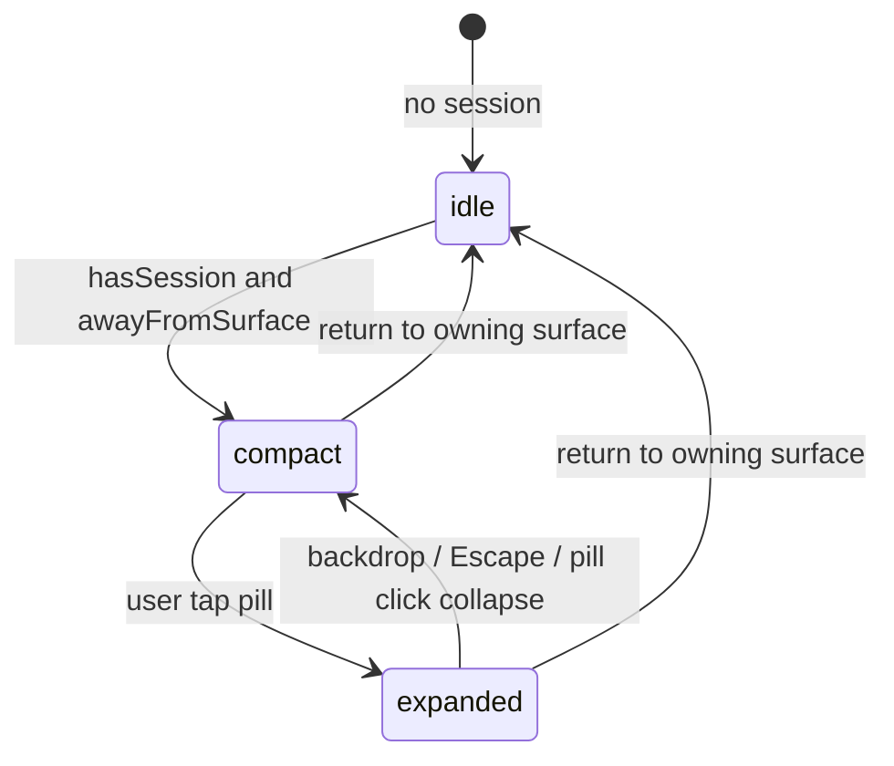

# Dynamic Island: architecture and usability

This document describes how the RuForge activity island expands, animates, and wires playback. Read this before changing island UI, adding onboarding, or refactoring motion code.

**Primary files**

| File | Role |
|------|------|
| `ActivityIsland.tsx` | Integration layer: session state, user expand/collapse, portal mount, handlers, content mapping |
| `DynamicIsland.tsx` | Visual shell: single morphing container + inner content swap |
| `ActivityIslandWaveform.tsx` | Five-bar accent waveform (compact + expanded header) |
| `IslandAudioOutputControl.tsx` | Headphones MorphMenu (`paintedRest={false}`); device list from main content |
| `islandIcons.tsx` | SVG icons for expanded controls |
| `src/lib/activityIslandResolve.ts` | Pure rules: when island shows, when expand is allowed, navigate-to-owner |
| `src/hooks/useCurrentActivity.ts` | Session snapshot: file, paused, time, cover |
| `src/lib/mainPlaybackBridge.ts` | Cross-tree playback telemetry + control callbacks (video + music host) |
| `src/context/MainPlaybackContext.tsx` | Publishes bridge from `PlayerView` / `MainPlaybackHost` |
| `App.tsx` | Mounts `<ActivityIsland />` when `!shellBlocked`; runs `useDesktopIslandOverlay` for minimized/tray desktop island |
| `IslandOverlayApp.tsx` | Desktop overlay webview (`island` label): Dynamic Island only |
| `src/hooks/useDesktopIslandOverlay.ts` | Show/hide desktop island + telemetry push |
| `src/lib/desktopIslandBridge.ts` | Cross-window state/control events for desktop island |
| `src-tauri/src/commands/island_overlay.rs` | Transparent always-on-top `island` window |

Tests for resolve/navigation rules: `src/lib/activityIslandResolve.test.ts`.

---

## Mental model: two layers

```
┌─────────────────────────────────────────────────────────────┐
│  ActivityIsland (logic)                                      │
│  - When does a session exist?                                │
│  - Is user away from owning surface?                         │
│  - Did user tap to expand?                                     │
│  - Maps playback → DynamicIslandContent                      │
│  - Portal to document.body, backdrop, z-index                │
└──────────────────────────┬──────────────────────────────────┘
                           │ state: "idle"|"compact"|"expanded"
                           │ content + event handlers
                           ▼
┌─────────────────────────────────────────────────────────────┐
│  DynamicIsland (presentation)                                │
│  - ONE motion.div morphs width/height/borderRadius           │
│  - AnimatePresence swaps inner content (absolute fill)       │
│  - No second card mount; no cross-fade between two shells    │
└─────────────────────────────────────────────────────────────┘
```

**Rule:** Business logic stays in `ActivityIsland` + hooks/lib. `DynamicIsland` is props-in, pixels-out. Do not read Zustand or the playback bridge inside `DynamicIsland.tsx`.

---

## State machine

Four visual states (`IslandState`); `capture` is dev-only (crash-recovery preview):

| State | Size (px) | When |
|-------|-----------|------|
| `idle` | 120 × 36, radius 18 | No session, or session exists but user is on the owning surface and island chrome is hidden |
| `compact` | 220 × 36, radius 18 | Active session and user is away from owning surface (pill) |
| `capture` | fits label, height 36, radius 18 | Dev crash-recovery preview after a capture saves (wide pill with filename, not full expanded height) |
| `expanded` | 350 × 184, radius 40 | Compact + user tapped pill + expand still allowed |

### Inputs that drive `islandState` (in `ActivityIsland`)

```text
renderState     ← useCurrentActivity (idle | main-music | main-video | mini-owned)
hasSession      ← renderState !== "idle"
awayFromSurface ← activityIslandResolve.resolveActivityAwayFromSurface(...)
userExpanded    ← local useState, toggled by pill click / Escape / backdrop
canExpand       ← hasSession && awayFromSurface
isExpanded      ← userExpanded && canExpand

showIslandChrome ← awayFromSurface || isExpanded

islandState =
  !hasSession || !showIslandChrome → idle
  isExpanded                       → expanded
  else                             → compact
```



### Away-from-surface rules (`activityIslandResolve.ts`)

| `renderState` | Owning surface | `awayFromSurface` when |
|---------------|----------------|------------------------|
| `idle` | n/a | always false |
| `main-music` | Music shell (`navMode === "music"`) | `navMode !== "music"` |
| `main-video` | Player tab (`activeTab === "player"`) | `activeTab !== "player"` |
| `mini-owned` | Mini player | always true (stub pill) |

This is **model A**: the island component stays mounted; visibility is driven by `showIslandChrome` and `islandState`, not by unmounting the tree.

**`idle` is a real, visible state** — a 120×36 empty pill, not "nothing rendered." `ActivityIsland` does not early-return to `null` for "no session." The only thing that suppresses `ActivityIsland`'s render is `onboardingOccupied` (see "Onboarding occupancy" below), so there is exactly one pill at the titlebar slot at all times — either the activity pill (idle/compact/expanded) or the onboarding pill, never both, never neither.

---

## Animation system (do not break)

Library: **`motion/react`** (Framer Motion v11+ import path).

### 1. Single morphing shell

One persistent `motion.div` in `DynamicIsland.tsx`:

```tsx
const ISLAND_DIMENSIONS = {
  idle:     { width: 120, height: 36,  borderRadius: 18 },
  compact:  { width: 220, height: 36,  borderRadius: 18 },
  expanded: { width: 350, height: 184, borderRadius: 40 },
};

<motion.div
  initial={false}
  animate={ISLAND_DIMENSIONS[state]}
  transition={{ type: "spring", stiffness: 350, damping: 27, mass: 0.8 }}
  style={{ originY: 0, WebkitAppRegion: "no-drag" }}
/>
```

**Critical invariants**

- **`initial={false}`** on the shell: avoids a pop-in on first mount when switching from idle to compact.
- **`originY: 0`**: expansion grows **downward** from the top edge. Do not center the expanded island vertically in a short titlebar wrapper (that clips the top off-screen).
- **Animate `width`, `height`, `borderRadius` on this one node only.** Inner layouts must flex inside the box; never animate width/height on children for the expand/collapse effect.
- **Spring constants** (`ISLAND_SPRING`): changing stiffness/damping noticeably changes feel. Treat as product-tuned; adjust only intentionally.
- **`overflow-hidden`** on the shell clips inner content to the pill shape during morph. Expanded content must fit in 350×184 or be truncated/scrolled inside, not spill outside.

### 2. Inner content swap (`AnimatePresence`)

Three mutually exclusive inner trees, absolutely positioned:

| Component | Key | Pointer events |
|-----------|-----|----------------|
| `IdleContent` | `"idle"` | `pointer-events-none` (empty) |
| `CompactContent` | `"compact"` | inner `pointer-events-none`; clicks pass to shell `onClick` |
| `ExpandedContent` | `"expanded"` | `pointer-events-auto` + `stopPropagation` on inner clicks |

```tsx
<AnimatePresence initial={false}>
  {state === "idle" && <IdleContent key="idle" />}
  {state === "compact" && <CompactContent key="compact" ... />}
  {state === "expanded" && <ExpandedContent key="expanded" ... />}
</AnimatePresence>
```

**Critical invariants**

- **`initial={false}`** on `AnimatePresence`: same reason as shell; prevents double-enter on first show.
- **Exactly one branch true** for a given `state`. Never render compact + expanded together.
- **Stable `key` strings** (`"idle"`, `"compact"`, `"expanded"`): required for exit/enter transitions.
- **Compact** uses `ContentShell` (scale 0.8 → 1, opacity fade, 0.1s delay).
- **Expanded** uses its own `motion.div` (scale 0.9 → 1). Do not nest another full-size morphing container inside.

### 3. Waveform (`ActivityIslandWaveform.tsx`)

- Five bars, `scaleY` animation (not height), `repeatType: "mirror"` when playing.
- **`waveformPaused`** can differ from control `paused` in theory; today both come from activity stub/paused flags in `ActivityIsland`.
- Bars use `transform` only (good for perf). Do not switch to width/height animation on bars.

### 4. Progress bar in expanded state

- Width driven by CSS `width: ${progress}%` with `transition-[width] duration-150`.
- This is intentional and separate from the spring morph. Do not spring-animate the scrubber.

---

## Layout and stacking (window chrome)

### Portal

`ActivityIsland` uses `createPortal(..., mainWindowPortalRoot())` (`#root`).

**Why:** The app root uses `overflow-hidden`. Mounting the island inside the main column clips expanded height and breaks titlebar alignment.

**Do not** move the island back into `App.tsx` layout without fixing overflow on ancestors.

### Positioning

```tsx
// Wrapper (pointer-events-none except island)
fixed top-0 left-1/2 -translate-x-1/2 z-[110]
pt-[6px]                    // centers 36px pill in 48px titlebar
overflow-visible            // expanded card extends below titlebar
max-w-lg

// DynamicIsland (pointer-events-auto)
WebkitAppRegion: "no-drag"  // Tauri: clicks hit island, not drag strip
```

Titlebar height token: `--rf-titlebar-h: 48px` in `src/index.css`. Content column uses `pt-[var(--rf-titlebar-h)]`.

### Z-index stack

| Layer | z-index | Purpose |
|-------|---------|---------|
| Drag region | 50 | Window drag strip |
| Expanded backdrop dismiss | 109 | Full-screen transparent button |
| Island portal wrapper | 110 | Pill + expanded card |
| Window controls | 100 | Right titlebar (separate fixed layer) |

Onboarding or coach marks must account for this ordering (see below).

### Shadow

`shadow-2xl` only when `state === "expanded"`. Compact pill has no shadow (functional shadow rule).

---

## Pointer events contract

| User action | Handler | Notes |
|-------------|---------|-------|
| Tap compact pill | Shell `onClick` → `setUserExpanded(true)` | Compact inner content is non-interactive |
| Tap expanded shell padding | Shell `onClick` → collapse | Rare; most area is ExpandedContent |
| Tap backdrop | `setUserExpanded(false)` | Only mounted when expanded |
| Escape | `setUserExpanded(false)` | window listener while expanded |
| Play/pause, skip, seek, open | Expanded buttons; all `stopPropagation` | Shell click must not collapse when using controls |
| Audio output (headphones) | `setAudioOutputDeviceId` on main; desktop overlay emits `audioOutput` control | Applies `setSinkId` on media el + analyser `AudioContext` when MES-routed |
| Open player (airplay icon) | `navigateToActivityOwningSurface` | Music → `setNavMode("music")`, video → `setActiveTab("player")` |

**Do not** remove `stopPropagation` from expanded controls without re-testing collapse behavior.

---

## Playback and content mapping

### Data flow

```text
MainPlaybackHost (music audio)  ─┐
PlayerView (video)               ├── MainPlaybackProvider → mainPlaybackBridge
                                  │
useCurrentActivity ← subscribeMainPlaybackBridge
ActivityIsland     ← useCurrentActivity + playback bridge for controls
DynamicIsland      ← content prop only
```

### `DynamicIslandContent` fields (built in `ActivityIsland`)

| Field | Source |
|-------|--------|
| `paused` | Island UI for play/pause icon |
| `waveformPaused` | `isStub \|\| paused` |
| `showTrackSkip` | `renderState === "main-music"` |
| `showExpandedControls` | `isExpanded && !isStub && hasSession` |
| `canSeek` | bridge has `seek` + duration > 0 + not stub |
| `accentColor` | Settings accent (`ActivityIsland`); waveform fallback when no cover or mini stub |
| `audioOutputDeviceId` | Persisted app-wide sink id (`audioOutputDevices.ts`); empty = system default |
| `audioOutputDevices` | Main-enumerated outputs (pushed to desktop overlay; overlay webview cannot list devices) |

Expanded headphones control uses MorphMenu with bare rest (icon only). Open shell is opaque `#271C18`. Routes output on the owning main media element. Desktop overlay is remote only: selection goes through `DesktopIslandControl` `{ type: "audioOutput"; deviceId }` and is applied on main (including `AudioContext.setSinkId` when the island waveform uses a media-element source).

### Video bridge note

`PlayerView` uses `MainPlaybackProvider` with `liveTelemetry`. Time/paused/duration patch from the `<video>` element on `timeupdate`; provider preserves live telemetry when refreshing callbacks. **Do not** republish stale React state over live video telemetry when touching `MainPlaybackContext`.

### Stub mode (`mini-owned`)

Mini player owns playback. Island shows cover + stub label; expanded controls hidden (`showExpandedControls` false). Play/open navigates via `navigateToActivityOwningSurface`.

---

## App integration

```tsx
// App.tsx
{!shellBlocked && <ActivityIsland />}
```

`shellBlocked = Boolean(postInstall)` only. **Onboarding no longer factors into this guard.** `ActivityIsland` is mounted whenever the shell isn't post-install-blocked, including for the entire duration of onboarding — it just renders `null` while onboarding is occupying the island (see "Onboarding occupancy" below).

Music mode: island portal still renders above `MusicShell` when away from music surface (e.g. user switched to default mode while audio continues via `MainPlaybackHost`).

---

## Desktop overlay (minimized / tray-hidden)

When the **main** window is OS-minimized or hidden to tray, and playback is **main-owned** (`main-music` / `main-video`), a separate transparent always-on-top webview (`label: island`) shows only the Dynamic Island at the **top center** of the monitor the main window was on (cached before minimize/hide; falls back to primary).

**Show rules**

- Triggers: minimize **or** close-to-tray hide (`ruforge:main-hidden` from Rust CloseRequested path).
- Session required: active main-owned session (paused still counts).
- Suppress when `activityOwner` is mini (`video-mini` / `music-mini`): mini is already the surface.
- Hide when main is restored/shown, session ends, or mini takes ownership.

**Architecture**

- Media stays in `main`. Overlay is remote control only (no media element).
- Events: `desktop-island-state` (main → island), `desktop-island-control` (island → main). Control types include play/seek/skip/volume/mute/loop/`audioOutput`/open/popOut.
- Window bounds hug compact (~380×56) or expanded (~380×220); `sync_island_overlay_bounds` on expand/collapse. Expanded collapses on Escape or when the overlay window blurs (click outside).
- Placement uses the main window's monitor (`note_main_window_monitor` on move/resize and before tray hide); minimized outer coords are ignored so the island does not jump to the primary display.
- Reuses `DynamicIsland` presentation; does not mount idle empty pill on the desktop (window hidden when no session).

**Do not** drive desktop overlay from Zustand inside `DynamicIsland.tsx`. Keep bridge apply logic in `desktopIslandBridge.ts` / `useDesktopIslandOverlay.ts`.

---

## Safe change guide (for agents)

### Allowed without animation risk

- Copy, typography, colors, spacing **inside** fixed expanded layout (350×184).
- Adding non-interactive badges in compact/expanded content.
- New handlers wired from `ActivityIsland` through existing callback props.
- Waveform bar fill: blurred cover slices (`ActivityIslandWaveform` + `.rf-island-waveform-art-bg`). No canvas palette extraction on the island path.
- Tests in `activityIslandResolve.test.ts`.

### Change with care (read this doc first)

- `ISLAND_DIMENSIONS` sizes: update expanded layout padding if height/width change.
- `ISLAND_SPRING`: product feel change; verify compact ↔ expanded ↔ idle.
- `showExpandedControls` conditions: affects whether scrubber/controls appear.
- z-index or portal target: test against titlebar drag, window controls, onboarding.
- `shellBlocked` interaction: onboarding z-index vs 109/110.

### Do not do (common breakages)

| Anti-pattern | Why it breaks |
|--------------|----------------|
| Second morphing wrapper around `DynamicIsland` | Double animation, layout fight |
| Replace single shell with separate compact/expanded components | Loses morph; reintroduces flash |
| Mount island inside `overflow-hidden` ancestor without portal | Expanded top clipped |
| Vertically center expanded island in a 48px-tall flex row | Expanded grows upward off-screen |
| Animate inner content width/height for expand | Jank; violates perf rules |
| Drive expand by CSS class on App root instead of `state` prop | Bypasses AnimatePresence keys |
| Call `setActiveTab("player")` for music sessions | Breaks audio; use `navigateToActivityOwningSurface` |
| Read store inside `DynamicIsland.tsx` | Couples presentation to logic; hard to test/onboard |
| Remove `initial={false}` | First-show pop / double enter |
| Remove `originY: 0` | Expansion anchor wrong |
| Fade an island to `opacity: 0` and unmount on completion | Island "disappears" — there must always be exactly one pill (idle or otherwise) at the titlebar slot |
| Add a second always-mounted island component for onboarding/coach marks | Two competing pills; use the occupancy bridge to time-share the existing slot instead |
| Gate `ActivityIsland` mount on `onboardingOpen`/`shellBlocked` for onboarding | Reintroduces the gap this architecture closes; use `setOnboardingIslandOccupied` instead |

---

## Adding onboarding later

Onboarding lives in `src/components/onboarding/` + `src/lib/onboardingSteps.ts` (see `AGENTS.md` onboarding contract). The island is a good walkthrough target because it is discoverable and gesture-based.

### Recommended approach

1. **Add a registry step** in `onboardingSteps.ts` (copy + optional media under `src/assets/onboarding/`).
2. **Run after `shellBlocked` clears** so `ActivityIsland` is mounted (same pattern as post-install → onboarding chain in `App.tsx`).
3. **Coach mark / spotlight** should sit **below** the island (`z < 109`) or use a cutout that does not intercept island clicks (`pointer-events-none` on overlay, hole over pill).
4. **Do not mount a fake island** for the tutorial. Prefer:
   - **Option A:** Real playback session (user starts music/video, navigates away, then step highlights compact pill).
   - **Option B:** Dev-only demo flag on `ActivityIsland` that forces `userExpanded` + mock `content` (keep behind `import.meta.env.DEV` or explicit debug setting; never ship fake playback in production).
5. **If demonstrating expand:** call flow that sets `userExpanded` through a ref or tiny context **owned by `ActivityIsland`**, not by duplicating `DynamicIsland` in onboarding UI.
6. **Dismiss expanded state** when onboarding step advances (`setUserExpanded(false)` in step cleanup) so backdrop (`z-109`) does not block onboarding chrome.

### Suggested extension point (not implemented yet)

If onboarding needs programmatic control, add to `ActivityIsland` only:

```tsx
// Example future API — implement when onboarding step is authored
export type ActivityIslandDemoController = {
  forceExpanded: boolean;
  mockContent?: Partial<DynamicIslandContent>;
};
```

Wire via React context consumed **only** by `ActivityIsland`, merging mock content over real activity when demo flag set. **`DynamicIsland` props stay the same.**

### Onboarding step ideas (product)

- Step 1: compact pill appears when you leave the player while something plays.
- Step 2: tap pill to expand; show scrubber + controls.
- Step 3: tap open icon returns to music mode or player (mode-aware).

### Onboarding island (Alt radial step)

`OnboardingIsland.tsx` reuses the titlebar portal slot (`z-110`, `pt-[6px]`) but is **not** `ActivityIsland`. It mounts during onboarding island steps only (`OnboardingFlow`), portaled to `#root` via `mainWindowPortalRoot()` (same as `ActivityIsland`).

- **Compact:** `Switch app modes · hold` + key cap until ring completes; then `Click` + RuForge icon + `to change modes` (latched); upward fade; 268×36 pill.
- **Outer progress:** holding Alt fills the pill perimeter (~500ms); release early resets; ring hides once complete.
- **Complete:** radial center click triggers celebrate (~1.6s) then unmount; `onboardingLastSeenVersion` persisted so the pill does not return until a new step ships (Settings > Debugging replay resets last-seen to `0.0.0`).
- **Expanded (tap pill):** placeholder GIF + caption; 350×268 shell with backdrop at `z-109`. Alt-hold progress still works while expanded.
- **No full-screen onboarding overlay.** Welcome/feature cards are not used in the shipped flow.
- **Shell block:** onboarding never sets `shellBlocked`; Alt radial stays enabled.

#### Phases

`OnboardingIsland` phases: `"active"` → `"celebrate"` ("nice!" ~1s) → `"idle"` (empty pill, releases occupancy) → unmount via `onDismiss()`. Timers use a stable dismiss ref so parent re-renders do not reset the countdown.

#### Onboarding occupancy bridge

Two islands exist in the tree simultaneously during onboarding (`OnboardingIsland` + always-mounted `ActivityIsland`), so a pub/sub in `onboardingRadialBridge.ts` arbitrates which one renders:

```ts
// OnboardingIsland: publishes occupancy on every phase change
setOnboardingIslandOccupied(phase !== "idle");
// on unmount: setOnboardingIslandOccupied(false)

// ActivityIsland: subscribes via useSyncExternalStore
const onboardingOccupied = useSyncExternalStore(
  subscribeOnboardingIslandOccupiedChange,
  getOnboardingIslandOccupied,
  getOnboardingIslandOccupied,
);
if (onboardingOccupied) return null;
```

- While `OnboardingIsland` is in `"active"` or `"celebrate"`, `ActivityIsland` renders `null` — no double pill.
- The moment `OnboardingIsland` reaches `"idle"`, occupancy flips to `false` and `ActivityIsland` resumes rendering its own `idle`/`compact`/`expanded` pill immediately (before `OnboardingIsland` has even unmounted), per the dims/content invariant above.
- **Precedence rule:** onboarding hint takes priority until dismissed; real playback activity (even if it starts mid-onboarding) only becomes visible once onboarding reaches `idle` and releases occupancy.
- If you add more onboarding island steps or other overlays that share this slot, they must follow the same occupancy contract — never assume `ActivityIsland` is unmounted; assume it's suppressed via this flag.

### Verification checklist after any island/onboarding change

- [ ] Start video, leave player tab: compact pill visible, waveform moves, top not clipped.
- [ ] Tap pill: expands downward to full 350×184, backdrop dismiss works.
- [ ] Play/pause, seek, skip (music), open player: correct mode navigation.
- [ ] Start music in music mode, switch to default mode: pill visible; open goes to music mode, audio continues.
- [ ] Return to owning surface: pill returns to idle (empty pill stays visible), no orphan backdrop.
- [ ] Escape collapses expanded state.
- [ ] With post-install open: island hidden entirely.
- [ ] Onboarding island step plays through to completion: hint → celebrate ("nice!") → idle pill, with **no flash/disappear/pop** at any transition, including the final handoff to `ActivityIsland`.
- [ ] Start real playback mid-onboarding: activity pill stays hidden until the onboarding hint reaches idle/dismisses (precedence rule).
- [ ] Resize window: pill stays centered horizontally, aligned to titlebar.
- [ ] Play content, minimize main: desktop island appears top-center; expand + transport work; Open restores main.
- [ ] Play content, close-to-tray: desktop island appears; restore via tray Show hides it.
- [ ] Mini owns playback + minimize main: no desktop island.

---

## Related docs

- `AGENTS.md`: Shipped log, onboarding contract, pointer to this file.
- `STATE.md`: Current release focus.
- `docs/ruforge/plans/`: Feature specs (if any island-specific plan exists).

When you change expand behavior or animation constants, append one line to the `AGENTS.md` Shipped log under the current `(unreleased)` version. If you discover a new invariant or usability rule, append it **here** (see `AGENTS.md` Dynamic Island section).
